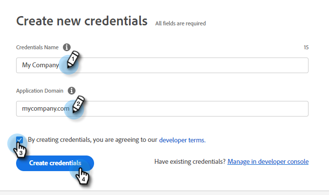
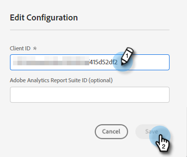

# Adobe PDF 嵌入式 API {#adobe-pdf-embed-api}

“文档”卡允许将PDF文档嵌入对话框并跟踪访客的文档参与活动。 按照以下步骤进行设置。

1. 导航到[Adobe PDF Embed API](https://udp.adobe.io/document-services/apis/pdf-embed/){target="_blank"}。

1. 单击 **[!UICONTROL Get Credentials]**。

   

1. 登录到您的Adobe帐户。

   

1. 输入凭据，接受条款，然后单击&#x200B;**[!UICONTROL Create Credentials]**。

   

   >[!IMPORTANT]
   >
   >您需要使用将在其上托管聊天机器人的域（例如，如果您在mycompany.com上托管该聊天机器人，请在步骤4中输入该域）。

1. 单击&#x200B;**[!UICONTROL Copy]**&#x200B;以复制您的客户端ID。

   

1. 返回Dynamic Chat，单击&#x200B;**[!UICONTROL Integrations]**。 在Adobe PDF Embed API信息卡中，单击&#x200B;**[!UICONTROL Activate]**。

   

1. 粘贴[!UICONTROL Client ID]并单击&#x200B;**[!UICONTROL Save]**。

   

您现在可以在对话框的[流Designer](/help/marketo/product-docs/demand-generation/dynamic-chat/automated-chat/stream-designer.md){target="_blank"}中使用文档信息卡。
