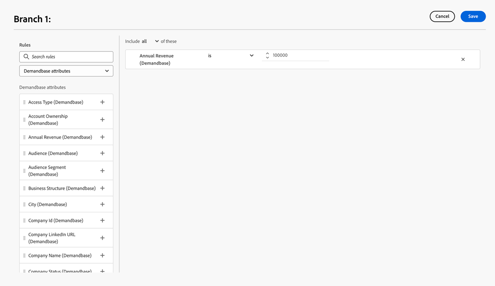

# Demandbase {#demandbase}

Demandbase用户可以使用Demandbase人员属性在Dynamic Chat中进行对话框定位、条件品牌推广和自定义路由。

## 访问Dynamic Chat的API密钥 {#access-the-api-key-for-dynamic-chat}

以下步骤将在您的Demandbase帐户&#x200B;_中完成_。

1. 在Demandbase中，单击&#x200B;_设置_&#x200B;图标。

   

1. 在&#x200B;_集成_&#x200B;下，选择&#x200B;**帐户连接器**。

1. 单击&#x200B;**+新建**&#x200B;按钮。

1. 在&#x200B;_集成名称_&#x200B;下拉列表中，选择&#x200B;**Adobe Dynamic Chat**。

1. 选择&#x200B;**服务器端**&#x200B;单选按钮。

1. 单击&#x200B;**创建**。

1. 使用&#x200B;_复制_&#x200B;图标，复制页面底部的API令牌字符串。

1. 提交具有[Marketo支持](https://nation.marketo.com/t5/support/ct-p/Support)的票证，并提供API令牌字符串以激活Demandbase集成。

>[!NOTE]
>
>有关其他信息，请参阅Demandbase帮助网站中的[设置Demandbase以将数据发送到集成（帐户连接器）](https://support.demandbase.com/hc/en-us/articles/360057169531-Set-Up-Demandbase-to-Send-Data-to-an-Integration-Account-Connector){target="_blank"}。

## 集成功能 {#integration-features}

在创建对话框或对话流时，除了本机属性和自定义属性之外，还根据Demandbase属性定位受众。

使用Demandbase属性作为条件分支、对话框或对话流中的条件。

在定义任何自定义路由逻辑时，请使用Demandbase属性。

