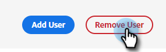

# 添加或删除聊天用户 {#add-or-remove-chat-users}

按照以下步骤添加或删除聊天用户。

## 添加聊天用户 {#add-a-chat-user}

1. 登录到 [Adobe Admin Console](https://adminconsole.adobe.com/){target="_blank"}.

   

1. 单击 **[!UICONTROL Dynamic Chat]**.

   

   >[!NOTE]
   >
   >如果您有多个Marketo订阅，请在下一步之前选择所需的订阅。

1. 单击 **[!UICONTROL 用户]** 选项卡。

   

1. 单击 **[!UICONTROL 添加用户]** 按钮。

   

1. 输入要添加的用户的名称、用户组或电子邮件地址。 名字和姓氏是可选的。

   

1. 单击 **+** 图标，然后选择所需的产品配置文件。

   

1. 单击&#x200B;**[!UICONTROL 保存]**。

   

## 添加Dynamic Chat对Marketo角色的访问权限 {#add-dynamic-chat-access-to-marketo-role}

如果新添加的聊天用户的Marketo角色还没有Dynamic Chat权限，请参阅以下添加方法。

1. 在Marketo中，单击 **[!UICONTROL 管理员]** 并选择 **[!UICONTROL 用户和角色]**.

   

1. 单击 **[!UICONTROL 角色]** 选项卡。

   

1. 从列表中，选择要修改的角色，然后单击 **[!UICONTROL 编辑角色]**.

   

1. 选择 **[!UICONTROL 访问Dynamic Chat]** 并单击 **[!UICONTROL 保存]**.

   

## 删除聊天用户 {#remove-a-chat-user}

1. 登录到 [Adobe Admin Console](https://adminconsole.adobe.com/){target="_blank"}.

   

1. 单击 **[!UICONTROL Dynamic Chat]**.

   

   >[!NOTE]
   >
   >如果您有多个Marketo订阅，请在下一步之前选择所需的订阅。

1. 单击 **[!UICONTROL 用户]** 选项卡。

   

1. 选择要删除的用户。

   

1. 单击 **[!UICONTROL 删除用户]** 按钮。

   

1. 单击 **[!UICONTROL 删除用户]** 以确认。

   

>[!MORELIKETHIS]
>
>* [Adobe Admin Console用户](https://helpx.adobe.com/cn/enterprise/using/users.html){target="_blank"}
>* [单独管理用户](https://helpx.adobe.com/enterprise/using/manage-users-individually.html){target="_blank"}
