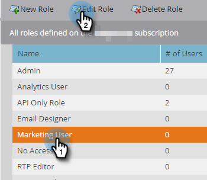

# 添加或移除聊天用户 {#add-or-remove-chat-users}

按照以下步骤添加或删除聊天用户。

>[!NOTE]
>
>默认情况下，所有Marketo Engage管理员都将被授予Dynamic Chat中的管理员权限。

## 添加聊天用户 {#add-a-chat-user}

1. 登录到[Adobe Admin Console](https://adminconsole.adobe.com/){target="_blank"}。

   

1. 单击 **[!UICONTROL Dynamic Chat]**。

   

   >[!NOTE]
   >
   >如果您有多个Marketo订阅，请在下一步之前选择所需的订阅。

1. 单击&#x200B;**[!UICONTROL Users]**&#x200B;选项卡。

   

1. 单击&#x200B;**[!UICONTROL Add User]**&#x200B;按钮。

   

1. 输入要添加的用户的[!UICONTROL name, user group, or email address]。 名字和姓氏是可选的。

   

1. 单击&#x200B;**+**&#x200B;图标并选择所需的产品配置文件。

   

1. 单击 **[!UICONTROL Save]**。

   

   >[!NOTE]
   >
   >在Adobe Admin Console中添加用户后，这些用户可能需要长达两个小时才能显示在“Dynamic Chat代理管理”页面中。

## 将Dynamic Chat访问权限添加到Marketo角色 {#add-dynamic-chat-access-to-marketo-role}

如果新添加的聊天用户的Marketo角色还没有[!DNL Dynamic Chat]权限，请参阅以下添加方法。

1. 在Marketo中，单击&#x200B;**[!UICONTROL Admin]**&#x200B;并选择&#x200B;**[!UICONTROL Users & Roles]**。

   

1. 单击&#x200B;**[!UICONTROL Roles]**&#x200B;选项卡。

   

1. 从列表中选择要修改的角色，然后单击&#x200B;**[!UICONTROL Edit Role]**。

   

1. 选择 **[!UICONTROL Access Dynamic Chat]** 并点击 **[!UICONTROL Save]**。

   

## 删除聊天用户 {#remove-a-chat-user}

1. 登录到[Adobe Admin Console](https://adminconsole.adobe.com/){target="_blank"}。

   

1. 单击 **[!UICONTROL Dynamic Chat]**。

   

   >[!NOTE]
   >
   >如果您有多个Marketo订阅，请在下一步之前选择所需的订阅。

1. 单击&#x200B;**[!UICONTROL Users]**&#x200B;选项卡。

   

1. 选择要删除的用户。

   

1. 单击&#x200B;**[!UICONTROL Remove User]**&#x200B;按钮。

   

1. 单击&#x200B;**[!UICONTROL Remove User]**&#x200B;确认。

   

>[!MORELIKETHIS]
>
>* [Adobe Admin Console用户](https://helpx.adobe.com/cn/enterprise/using/users.html){target="_blank"}
>* [单独管理用户](https://helpx.adobe.com/cn/enterprise/using/manage-users-individually.html){target="_blank"}
