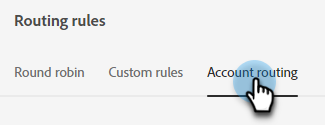
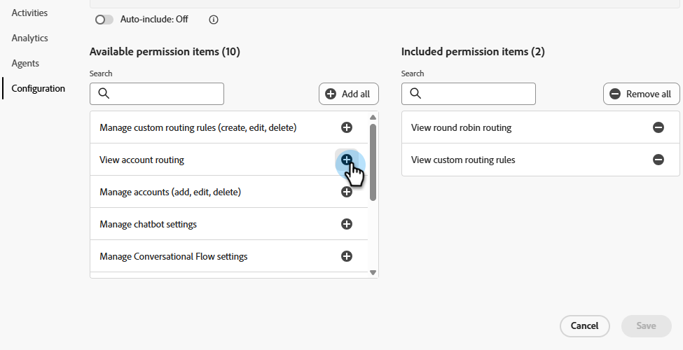
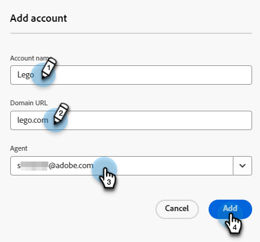

# 路由 {#routing}

在Dynamic Chat中预订的会议可以采用两种方式路由。 循环调度法，或使用自定义规则。

轮询：会议按顺序分配给座席。 如果你有5个座席，3个座席，参加上次会议，4个座席，接下一个，5个座席，然后返回1号座席。

自定义规则：您可以根据所选的属性选择特定座席以接收会议。

>[!NOTE]
>
>帐户路由被赋予最高优先级。 当访客到达对话点以预约会议或启动实时聊天时，首先会选中[帐户路由](#account-routing)，然后再考虑其他路由选项。

## 创建自定义规则 {#create-a-custom-rule}

在此示例中，我们将所有推断的状态（CA、OR和WA）的会议发送给John座席。

1. 在配置下，单击&#x200B;**路由规则**。

   

1. 默认情况下将打开&#x200B;**自定义规则**&#x200B;选项卡。

   

1. 单击&#x200B;**创建规则**。

   

1. 命名您的规则。 （可选）您可以添加说明并设置其优先级。 单击&#x200B;**下一步**。

   

1. 选择所需的座席。

   

1. 将拖到所需的属性上。

   

1. 查找并选择所需的值。

   

1. 选择所有所需值后，单击&#x200B;**保存**。

   

## 帐户路由 {#account-routing}

识别并上传您的目标帐户和各自的销售负责人，并将来自这些帐户的访客直接路由到各自的帐户负责人。

>[!PREREQUISITES]
>
>在Dynamic Chat中可见&#x200B;_帐户路由_&#x200B;之前，必须在Admin Console中启用权限。 请参阅下面的[启用权限](#enable-permissions)。

### 启用权限 {#enable-permissions}

+++ 启用帐户路由权限

1. 登录到[https://adminconsole.adobe.com/](https://adminconsole.adobe.com/){target="_blank"}。

1. 在&#x200B;_产品_&#x200B;下，选择&#x200B;**Dynamic Chat**。

   

1. 在&#x200B;_产品配置文件_&#x200B;下，选择所需的配置文件。

   

1. 单击&#x200B;**权限**&#x200B;选项卡。

   

1. 单击&#x200B;_配置_&#x200B;旁边的编辑图标（）。

   

1. 单击&#x200B;_查看帐户路由_&#x200B;旁边的&#x200B;**+**&#x200B;号。

   {width="600" zoomable="yes"}

1. 完成后单击&#x200B;**保存**。

+++

### 添加帐户 {#add-an-account}

在本例中，我们将把所有员工从乐高直接转给史蒂芬探员。

1. 在“帐户路由”选项卡中，单击&#x200B;**+添加帐户**。

   

   >[!TIP]
   >
   >通过单击&#x200B;**上传帐户列表**&#x200B;并上传CSV，您可以一次创建多个帐户。

1. 输入公司的名称、域，然后选择所需的代理。

   
