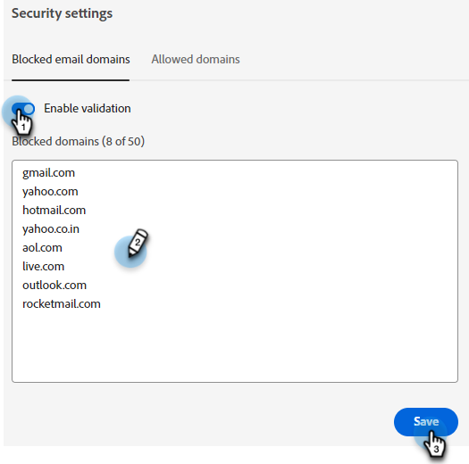

# 安全性设置 {#security-settings}

在“安全”设置中，您可以向被阻止或允许列表添加域。

## 阻止的电子邮件域 {#blocked-email-domains}

如果有任何访客具有您不希望代理与之交互（例如，竞争对手）的电子邮件域，请将其电子邮件域添加到。

1. 选择&#x200B;**启用验证**&#x200B;滑块以激活您的。 最多输入50个域，然后单击&#x200B;**保存**。

   

## 允许的域 {#allowed-domains}

添加允许的域可确保第三方无法从您的站点中刮取Javascript并将其添加到自己的站点中。

1. 选择&#x200B;**启用验证**&#x200B;滑块以激活您的。 输入允许的域，然后单击&#x200B;**保存**。

   
