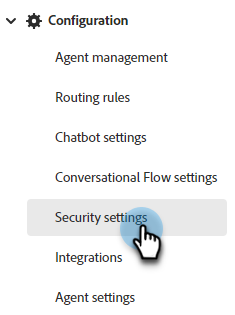

# 安全性设置 {#security-settings}

在“安全”设置中，您可以向被阻止或允许列表添加域。

>[!IMPORTANT]
>
>“阻止和允许电子邮件域”过滤仅适用于访客直接在Dynamic Chat中（在聊天机器人中或对话流中）输入其电子邮件地址的情况。 它不适用于Dynamic Chat从集成产品（如Marketo Engage）收到的电子邮件地址。 有关详细信息，请参阅下表。

| 场景 | 筛选是否适用？ |
|---|---|
| 访客在Dynamic Chat聊天机器人中直接键入其电子邮件 | 是 |
| 访客将电子邮件直接键入到Dynamic Chat对话流中 | 是 |
| 电子邮件是通过Marketo表单提交预填充的（在表单填写之后会显示对话流程） | 否 |
| 电子邮件会从任何其他集成系统传递到Dynamic Chat | 否 |

## 阻止的电子邮件域 {#blocked-email-domains}

如果有任何访客具有您不希望代理与之交互（例如，竞争对手）的电子邮件域，请将其电子邮件域添加到。

1. 选择&#x200B;**启用验证**&#x200B;滑块以激活您的。 最多输入50个域，然后单击&#x200B;**保存**。

   

## 允许的域 {#allowed-domains}

添加允许的域可确保第三方无法从您的站点中刮取Javascript并将其添加到自己的站点中。

1. 选择&#x200B;**启用验证**&#x200B;滑块以激活您的。 输入允许的域，然后单击&#x200B;**保存**。

   
