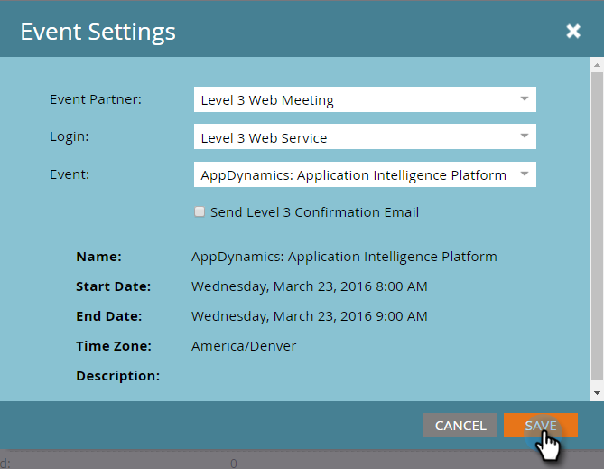

# 创建具有第3级Web会议的事件 {#create-an-event-with-level-web-meeting}

>[!PREREQUISITES]
>
>* [将第3级Web会议添加为LaunchPoint服务](/help/marketo/product-docs/administration/additional-integrations/add-level-3-web-meeting-as-a-launchpoint-service.md)
>* [创建新的事件程序](/help/marketo/product-docs/demand-generation/events/understanding-events/create-a-new-event-program.md)
>* 设置适当的 [流程操作](/help/marketo/product-docs/core-marketo-concepts/smart-campaigns/flow-actions/add-a-flow-step-to-a-smart-campaign.md)以跟踪参与情况

首先在级别3中创建网络研讨会。 如果您需要帮助，请查看 [3级资源库](https://www.level3.com/en/resource-library/). 您会发现它与BrightTalk非常相似。  Marketo使用3级字段的一个小子集：

* **名称**  — 网络广播的名称。
* **开始日期**  — 网络广播的开始日期。
* **结束日期**  — 网络广播的结束日期。
* **时区**  — 为网络广播设置的时区。
* **描述**  — 网络广播说明。

1. 选择您的新事件。 单击 **事件操作，** 则 **事件设置。**

   

1. 在事件合作伙伴下，选择 **3级Web会议**.

   

1. 在Login下，选择您的Level 3登录。

   

1. 在Event下，选择要使用的Level 3事件。

   

1. 单击 **保存**.

   

   太棒了！ 您已将活动连接到第3级！

## 查看计划  {#viewing-the-schedule}

在项目计划视图中，单击事件的日历条目。 您可以在屏幕右侧查看计划！

