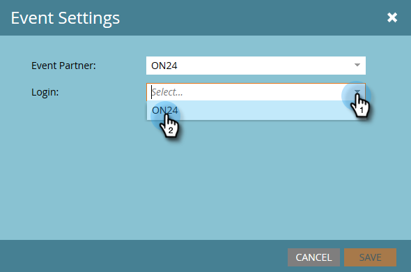

# 配置事件设置并将营销人员同步到网络研讨会 {#configure-event-settings-and-sync-marketo-with-your-webinar}

按照以下步骤配置Marketo事件设置并连接Marketo和ON24。

## 设置事件 {#set-the-event}

1. 选择要与ON24网络研讨会关联的事件，然后单击“ **事件操作** ”下拉框并选 **择事件设置**。

   

1. 选择ON24作为事件合作伙伴。

   

1. 选择登录帐户（例如，显示名称）。

   

1. 输入事件ID（从ON24获取此ID）。 单击 **保存**。

   

   >[!NOTE]
   >
   >在高峰期，ON24可能需要15到20分钟才能向Marketo提供事件信息。 如果收到“Invalid Session Id”（会话ID无效）消息，请稍后重试。

## 设置计划 {#set-the-schedule}

当您设置与ON24网络研讨会关联的事件时，事件计划将使用ON24中的数据进行填充。 要访问“事件计划”对话框，请按照以下步骤操作。

1. 选择事件。 单击 **事件操作** 下拉框，然后选择 **计划。**

   

1. 选择 **开始日期、结束日期**&#x200B;和 **时区**。 单击 **保存**。

   

   >[!NOTE]
   >
   >如果更新ON24中的任何事件信息，则必须单击“事件操 **作”菜单中的** “从网络研讨会提供者刷新”，以查看新数据的填充情况。

   [创建子活动和本地资产](create-child-campaigns-and-local-assets.md)

现在，您可以继续执行下一步：.

>[!NOTE]
>
>**相关文章**
>
>* [了解Marketo On24适配器事件](understanding-marketo-on24-adapter-events.md)
>* [创建子活动和本地资产](create-child-campaigns-and-local-assets.md)

>

