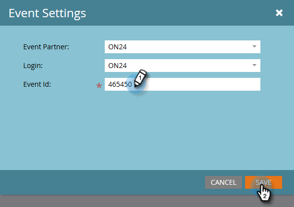

# 配置事件设置并将Marketo与网络研讨会同步 {#configure-event-settings-and-sync-marketo-with-your-webinar}

按照以下步骤配置Marketo事件设置并连接Marketo和ON24。

## 设置事件 {#set-the-event}

1. 选择要与ON24网络研讨会关联的事件，然后单击 **事件操作** 下拉框并选择 **事件设置**.

   

1. 选择ON24作为事件合作伙伴。

   

1. 选择登录帐户（例如，显示名称）。

   

1. 输入事件ID（从ON24获取）。 单击 **保存**.

   

   >[!NOTE]
   >
   >在高峰时段，ON24可能需要15到20分钟才能将事件信息提供给Marketo。 如果收到“会话ID无效”消息，请稍后重试。

## 设置计划 {#set-the-schedule}

在设置与ON24网络研讨会关联的事件时，事件计划会使用ON24中的数据填充。 要访问“事件计划”对话框，请执行以下步骤。

1. 选择事件。 单击 **事件操作** 下拉框并选择 **计划。**

   

1. 选择 **开始日期、结束日期**&#x200B;和 **时区**. 单击 **保存**.

   

   >[!NOTE]
   >
   >如果您更新了ON24中的任何事件信息，则必须单击 **从网络研讨会提供商刷新** ，以查看新数据填充。

现在，您可以继续执行下一步： [创建子营销活动和本地资产](/help/marketo/product-docs/demand-generation/events/create-an-event/create-an-event-with-the-marketo-on24-adapter/create-child-campaigns-and-local-assets.md){target=&quot;_blank&quot;}。

>[!MORELIKETHIS]
>
>[了解Marketo On24适配器事件](/help/marketo/product-docs/demand-generation/events/create-an-event/create-an-event-with-the-marketo-on24-adapter/understanding-marketo-on24-adapter-events.md){target=&quot;_blank&quot;}
