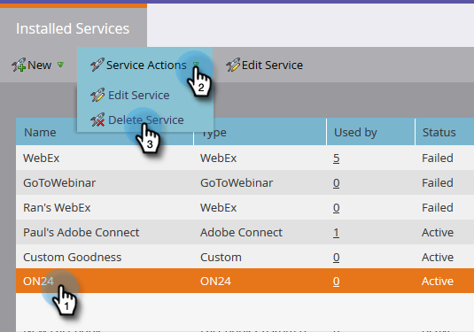

# 在Marketo {#enter-your-on-credentials-in-marketo}中输入您的ON24凭据

让我们开始ON24事件集成。 如果您曾经需要编辑或删除凭据，以下也包含这些步骤。

## 输入凭据{#enter-credentials}

1. 登录到Marketo并单击&#x200B;**管理**。

   

1. 在“集成”中，单击&#x200B;**LaunchPoint**。

   

1. 在“已安装的服务”下，单击&#x200B;**新建**，然后单击&#x200B;**新建服务**。

   

1. 在“新建服务”对话框中，输入以下信息：

   * **显示名称** -输入要在Marketo中使用的名称。如果您共享凭据，则这可以是您的名称或组的名称。
   * **服务** -从 **下** 拉菜单中选择On24。
   * **客户端** 键——输入用于登录的ON24客户端键。客户端键是包含字母和数字混合的32位字符串。
   * **客户端** ID —— 输入用于登录的4位ON24客户端ID。您可以直接从ON24客户端管理器获取客户端ID和客户端密钥。

   

1. 单击&#x200B;**创建**。

   

1. 成功验证凭据后，这些凭据将添加到“已安装的服务”页面。 如果出错，您将无法保存凭据。

## 编辑凭据{#edit-credentials}

如果密码过期或需要更改现有凭据，则可以编辑凭据。

1. 在“已安装的服务”选项卡中，选择要编辑的凭据，然后单击“编辑服务”**。**

   

1. 更新“编辑服务”对话框中的信息，然后单击“保存&#x200B;****”。

   

## 删除服务{#delete-a-service}

1. 在“已安装的服务”选项卡中，选择要删除的服务，单击&#x200B;**服务操作**&#x200B;下拉框，然后选择&#x200B;**删除服务**。

   

1. 单击&#x200B;**删除**。

   

下一步是[在ON24](/help/marketo/product-docs/demand-generation/events/create-an-event/create-an-event-with-the-marketo-on24-adapter/create-your-webinar-event-in-on24.md)中创建网络研讨会事件。

>[!MORELIKETHIS]
>
>[了解ON24适配器的营销事件](/help/marketo/product-docs/demand-generation/events/create-an-event/create-an-event-with-the-marketo-on24-adapter/understanding-marketo-on24-adapter-events.md)
