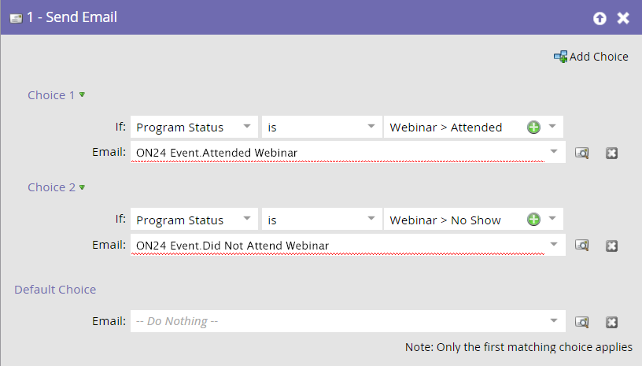

# ON24事件集成示例 {#example-on-event-integration}

以下是ON24网络研讨会的示例事件（包括促销活动）。 在构建活动时，请确保在运行活动之前对其进行测试。

## 在营销活动中创建新事件 {#create-a-new-event-in-marketing-activities}

1. 选择 **新建** > **新建项目群**.

   

1. 选择 **Campaign文件夹** 活动的举办地点。

   

1. 输入 **名称** 为活动准备的。

   

1. 选择 **事件** 作为 **项目类型**.

   

1. 选择 **网络研讨会** 作为 **渠道** 为活动准备的。

   

1. 单击&#x200B;**创建**。

   

## 邀请（批量营销活动）  {#invite-batch-campaign}

* **智能列表**  — 定义您将邀请谁参加活动。
* **流**

   * 发送电子邮件 — 如果这是本地资产电子邮件，则它将具有以下命名约定：EventName.EmailName。 您还可以使用全局电子邮件。
   * 进度中的更改状态 — 设置为“网络研讨会”>“已邀请”。

* **计划**  — 设置发送邀请的日期。

## 注册/确认（触发营销活动） {#registration-confirmation-trigger-campaign}

* **智能列表**

   * 触发促销活动依据 **填写表单**. 确保使用包含表单所在的登陆页面 **添加约束**，尤其是当表单在多个登陆页面上使用时。

>[!CAUTION]
>
>您必须使用Marketo表单注册事件用户，或使用具有正确API集成的非Marketo表单将注册数据推送到Marketo。 这对于成功集成Event Partner至关重要。 **注意**：如果您在非Marketo登陆页面上使用Marketo表单，则您的触发器将为 **填写表单** 表单名称。

* **流**

   * **进程中的更改状态**  — 设置为“网络研讨会”>“已注册”。 **注意**：在设置子营销策划时，此流程步骤是必需的。 当人员的进度状态更改为时 **已注册**，Marketo会将注册信息推送到ON24。

   * **发送电子邮件**  — 确认电子邮件(设置为 **可操作** 因此已注册的非订阅用户仍会收到该电子邮件)。

**注意**：如果返回人员时存在注册错误，则不会收到电子邮件确认。

## 提醒（批量营销活动） {#reminder-batch-campaign}

* **智能列表**  — 过滤方式 **计划成员** 并将状态设置为 **已注册**.

* **流量**  — 发送电子邮件（提醒电子邮件）。

**注意**：您可以使用类似的营销活动发送 *不同* 跟进发送给受邀但尚未注册的人员的电子邮件。

## 跟进营销活动（批量或触发营销活动） {#follow-up-campaign-batch-or-trigger-campaign}

* **智能列表**  — 根据项目状态的更改进行触发。

* **流量**  — 发送电子邮件。 根据项目状态使用选项发送不同的电子邮件。

>[!MORELIKETHIS]
>
>[了解Marketo ON24适配器事件](/help/marketo/product-docs/demand-generation/events/create-an-event/create-an-event-with-the-marketo-on24-adapter/understanding-marketo-on24-adapter-events.md){target="_blank"}
