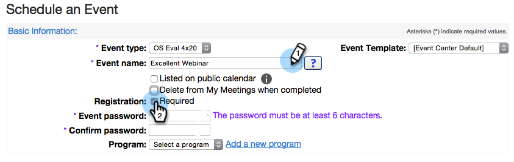
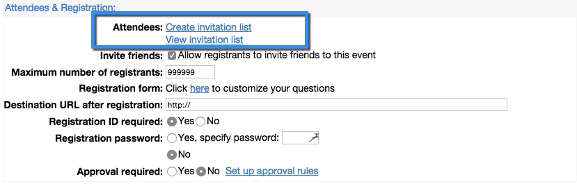

# 使用Webex创建事件 {#create-an-event-with-webex}

>[!PREREQUISITES]
>
>* [将Webex添加为LaunchPoint服务](/help/marketo/product-docs/administration/additional-integrations/add-webex-as-a-launchpoint-service.md)
>* [创建新事件程序](/help/marketo/product-docs/demand-generation/events/understanding-events/create-a-new-event-program.md)
>* 设置相应的 [流量操作](/help/marketo/product-docs/core-marketo-concepts/smart-campaigns/flow-actions/add-a-flow-step-to-a-smart-campaign.md) 跟踪参与度
>* 确保您使用的是Webex事件（经典）

首先在Webex事件中心创建Webex事件。 Marketo仅对您的集成使用特定设置和字段，我们将很快介绍这些设置和字段。 您可能想要为Webex配置的其他字段在 [Webex Event Center用户指南](https://www.cisco.com/c/dam/en/us/td/docs/collaboration/meeting_center/wbs298/wx_ec_host_ug.pdf).

>[!IMPORTANT]
>
>Marketo Engage仅支持在Webex事件（经典）中创建的事件。 Marketo当前不支持在Webex事件（新）中创建的事件。

## 基本信息 {#basic-information}

* **事件名称 —** 此名称将在Marketo中查看。
* **未列出的复选框**

   * 建议您 **not** 列出您的事件。 这将确保所有人员通过您的Marketo登录页面进行注册。 活动结束后，通过Marketo以外的机制注册的人员将在Marketo中显示，并且仅当他们参加了活动时才会显示。
   * 如果选择列出事件，该事件将显示在“事件列表”页面上，供访问您的事件中心网站的任何人使用。

* **注册 —** 选中此框可将设置为“必需”。 您将使用Marketo表单/登陆页面捕获将被推送到Webex的注册信息。
* **事件密码** — （可选）如果您使用此字段，请确保将其包含在确认电子邮件中！

## 日期和时间 {#date-time}

* **开始日期**  — 输入开始日期。 该内容可在Marketo中查看。

* **开始时间**  — 输入开始时间。 该内容可在Marketo中查看。

* **估计持续时间**  — 指定事件的持续时间。 该内容可在Marketo中查看。

* **时区**  — 输入适用的时区。 他们可在Marketo中查看。

## 音频会议设置 {#audio-conference-settings}

这些设置仅位于Webex中。 它们不供Marketo使用或在Adobe中查看，但它们可能对网络研讨会很重要，因此请仔细检查它们！

## 事件描述和选项  {#event-description-options}

以下选项由Marketo使用或可在Analytics中查看。 其他字段仅位于Webex中。

* **描述**  — 输入描述。 该内容可查看，但不能在Marketo中修改。
* **事件后调查** -Marketo当前无法捕获Webex事件后调查中的信息。
* **目标URL**  — （可选）您可以输入Marketo登陆页面的URL，以用作会话结束后显示的目标URL。

## 与会者和注册 {#attendees-registration}

您将使用Marketo事件控制邀请列表、注册表单和其他电子邮件。 Marketo将不支持其他功能，包括：

* **最大注册者数**  — 当前 **not** 受支持。  使用Marketo中的“待批准”进展状态，可以手动审批注册者。

* **需要注册ID**  — 当前支持使用Marketo-Webex集成。 您可以使用Marketo发出活动的确认电子邮件。 人员进行注册时，会收到用于输入事件的唯一URL。

   >[!TIP]
   >
   >要使用此唯一URL填充确认电子邮件，请在电子邮件中使用以下令牌： `{{member.webinar url}}`. 确认URL发出后，此令牌会自动解析为人员的唯一确认URL。
   >
   >将确认电子邮件设置为 **运行** 确保登记和可能被注销的人员仍收到确认信息。

* **注册密码**  — （可选）当前不支持使用Marketo-Webex集成。
* **批准规则**  — 当前不支持使用Marketo-Webex集成。 但是，您可以在Marketo中使用智能营销活动来控制批准。

### 演示者和小组成员 {#presenters-panelists}

此部分中配置的信息不会传递到Marketo。

### 电子邮件消息 {#email-messages}

您将使用Marketo向注册者发送电子邮件、确认电子邮件等。 您无需在此部分中配置任何内容。 禁用（取消选中）Webex中的电子邮件选项。

>[!NOTE]
>
>Marketo-Webex集成不支持从Webex发送确认电子邮件。 确认必须通过Marketo发送。 安排事件后，请确保将事件信息复制到Marketo确认电子邮件，并将电子邮件设置为 **运行**.

现在，我们准备跳进Marketo!

1. 选择您创建的事件。 打开 **事件操作** 下拉菜单。 选择 **事件设置。**

   

   >[!NOTE]
   >
   >所选事件的渠道类型必须为 **网络研讨会**.

1. 在 **活动合作伙伴**，选择 **韦贝**.

   

1. 在 **登录**，选择Webex登录名。

   

1. 在 **事件**，选择新创建的Webex事件。 然后，选择一个可选的备份页面，并单击 **保存**.

   

1. 为您的Webex事件选择一个可选的备份页面。 从已批准的Marketo登陆页面的下拉列表中进行选择，或输入非Marketo登陆页面的URL。

   >[!TIP]
   >
   >设置备用页面，如果成员在事件开始时间之前单击其自定义事件URL，则将其定向到特定页面。

   >[!NOTE]
   >
   >Marketo发送的字段包括：名字、姓氏、电子邮件地址。

   

   >[!CAUTION]
   >
   >避免使用嵌套电子邮件程序发出确认电子邮件。 请改用事件项目的智能营销活动，如上所示。

   >[!TIP]
   >
   >数据可能最多需要48小时才能在Marketo中显示。 如果等待了那么长时间后仍未看到任何内容，请选择 **从网络研讨会提供商刷新** 从 **概要** 选项卡。

真贴心！ Webex事件现在与Marketo事件同步。 注册网络研讨会的人员在将“新状态”设置为“已注册”时，将通过更改项目状态流程步骤推送到网络研讨会提供商。 没有其他状态会将人推过去。 另外，请务必执行更改项目状态流程步骤#1和发送电子邮件流程步骤#2。

## 查看计划  {#viewing-the-schedule}

在项目计划视图中，单击事件的日历条目。 您可以在屏幕右侧看到计划！

>[!NOTE]
>
>要更改事件计划，您需要在Webex上编辑网络研讨会。
