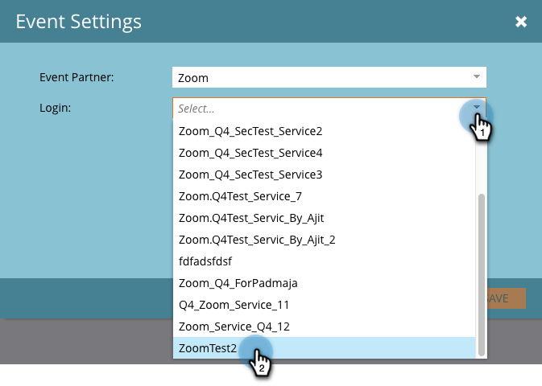

# 使用缩放创建事件 {#create-an-event-with-zoom}

>[!PREREQUISITES]
>
>* [将缩放添加为LaunchPoint服务](/help/marketo/product-docs/administration/additional-integrations/add-zoom-as-a-launchpoint-service.md)
>* [创建新的事件程序](/help/marketo/product-docs/demand-generation/events/understanding-events/create-a-new-event-program.md)
>* 设置适当的 [流操作](/help/marketo/product-docs/core-marketo-concepts/smart-campaigns/flow-actions/add-a-flow-step-to-a-smart-campaign.md)以跟踪参与情况

首先在Zoom中创建网络研讨会。 创建缩放过程中的某些设置将由Marketo使用，而某些设置仅由Zoom使用。

在您创建Marketo活动并为其关联Zoom网络研讨会后，系统将能够共享注册和出席信息。 有关创建网络研讨会的帮助，请参阅  [Zoom快速入门网络研讨会](https://support.zoom.us/hc/en-us/articles/200917029-Getting-Started-With-Webinar).

为您的网络研讨会输入以下信息，这些信息将通过适配器拉入Marketo。 如果您对此信息进行了任何更改，则必须单击“事件操作”下的“从网络研讨会提供商刷新”链接，以便Marketo能够看到这些更改。

**标题和描述**

* **网络研讨会名称**  — 输入网络研讨会的名称。 此名称将在Marketo中可见。

* **描述** （可选） — 输入网络研讨会的说明。 该描述可在Marketo中查看。

**日期和时间**

* **开始日期**  — 输入开始日期。 该可视化图表将显示在Marketo中。

* **开始时间**  — 输入您的开始时间。 该可视化图表将显示在Marketo中。

* **持续时间**  — 输入持续时间。 开始时间和结束时间将显示在Marketo中。

* **时区**  — 选择适用的时区。 该可视化图表将显示在Marketo中。

* **定期网络研讨会** — 保持未选中。

* **注册**  — 选中此框可使注册成为必填项。 您将使用Marketo表单/登陆页面捕获将推送到Zoom的注册信息。

>[!NOTE]
>
>Marketo当前不支持定期网络研讨会。 在每个Marketo事件和Zoom网络研讨会之间，必须设置一个会话。

>[!TIP]
>
>还有一些其他字段将以缩放形式配置，它们不会影响集成。 请参阅 [缩放网络研讨会帮助中心](https://support.zoom.us/hc/en-us/sections/200324965-Video-Webinar) 以了解有关这些字段的其他信息。

现在，让我们跳入Marketo！

1. 选择一个事件。 单击 **事件操作** 并选择 **事件设置**.

   

   >[!NOTE]
   >
   >所选事件的渠道类型必须是 **网络研讨会**.

1. 选择 **缩放** 从 **事件** **合作伙伴** 列表。

   

1. 选择要与事件关联的缩放帐户。

   

1. 选择网络研讨会。

   

1. 单击 **保存**.

   

   太棒了！ 现在，该事件已由Zoom同步并计划。

   >[!NOTE]
   >
   >Marketo发送的字段包括：名字、姓氏、电子邮件地址。

   >[!TIP]
   >
   >要使用此唯一URL填充确认电子邮件，请在电子邮件中使用以下令牌： `{{member.webinar url}}`. 在发送确认URL时，此令牌会自动解析为人员的唯一确认URL。
   >
   >将确认电子邮件设置为 **可操作** 以确保已注册和可能取消订阅的用户仍会收到其确认信息。

   注册您的网络研讨会的用户将通过 **更改项目状态** flow步骤。 没有其他状态会将人员推到。 此外，请务必确保 **更改项目状态** 流程步骤#1和 **发送电子邮件** 流程步骤#2。

   

   >[!CAUTION]
   >
   >避免使用嵌套电子邮件程序发送确认电子邮件。 请改用事件程序的智能营销活动，如上所示。

   >[!TIP]
   >
   >数据可能需要48小时才能显示在Marketo中。 如果在等待了那么长时间后仍未看到任何内容，请选择 **从网络研讨会提供商刷新** 从“事件操作”菜单 **摘要** 选项卡中列出的所有项目。
