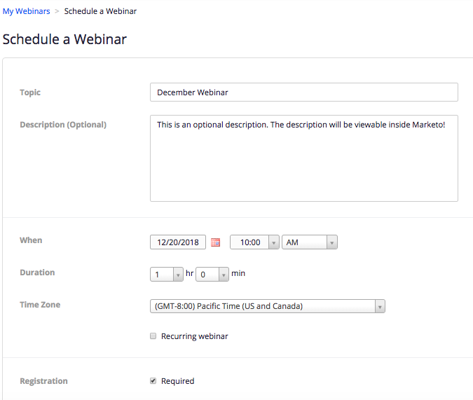

# 创建具有[!DNL Zoom]的事件 {#create-an-event-with-zoom}

>[!PREREQUISITES]
>
>* [添加 [!DNL Zoom] 为 [!DNL LaunchPoint] 服务](/help/marketo/product-docs/administration/additional-integrations/add-zoom-as-a-launchpoint-service.md)
>* [创建新的活动计划](/help/marketo/product-docs/demand-generation/events/understanding-events/create-a-new-event-program.md)
>* 设置适当的[流程操作](/help/marketo/product-docs/core-marketo-concepts/smart-campaigns/flow-actions/add-a-flow-step-to-a-smart-campaign.md)以跟踪参与

首先在[!DNL Zoom]中创建网络研讨会。 创建您的[!DNL Zoom]中的某些设置已被Marketo使用，而某些设置仅被[!DNL Zoom]使用。

在您创建Marketo活动并为其关联[!DNL Zoom]网络研讨会后，系统将能够共享注册和出席信息。 有关创建网络研讨会的帮助，请参阅[网络研讨会快速入门 [!DNL Zoom] ](https://support.zoom.us/hc/en-us/articles/200917029-Getting-Started-With-Webinar)。

为您的网络研讨会输入以下信息，这些信息将通过适配器拉入Marketo。 如果您对此信息进行了任何更改，则必须单击“事件操作”下的“从网络研讨会提供商刷新”链接，以便Marketo能够看到这些更改。

**标题和描述**

* **网络研讨会名称** — 输入网络研讨会的名称。 此名称将显示在Marketo中。

* **描述**（可选） — 输入网络研讨会的描述。 该描述将显示在Marketo中。

**日期和时间**

* **开始日期** — 输入您的开始日期。 该屏幕将显示在Marketo中。

* **开始时间** — 输入您的开始时间。 该屏幕将显示在Marketo中。

* **持续时间** — 输入持续时间。 开始时间和结束时间将显示在Marketo中。

* **时区** — 选择适用的时区。 该屏幕将显示在Marketo中。

* **定期网络研讨会** — 保持取消选中状态。

* **注册** — 选中此框可要求注册。 您将使用Marketo表单/登陆页面捕获将推送到[!DNL Zoom]的注册信息。

>[!NOTE]
>
>Marketo当前不支持定期网络研讨会。 在每个Marketo活动与[!DNL Zoom]网络研讨会之间，您必须设置一个会话。

>[!TIP]
>
>您将在[!DNL Zoom]中配置其他一些不会影响集成的字段。 有关这些字段的更多信息，请参阅[[!DNL Zoom] 网络研讨会帮助中心](https://support.zoom.us/hc/en-us/sections/200324965-Video-Webinar)。

现在，让我们跳入Marketo！

1. 选择一个事件。 单击&#x200B;**[!UICONTROL Event Actions]**&#x200B;并选择&#x200B;**[!UICONTROL Event Settings]**。

   

   >[!NOTE]
   >
   >所选事件的渠道类型必须是&#x200B;**网络研讨会**。

1. 从&#x200B;**[!UICONTROL Zoom]**&#x200B;列表中选择&#x200B;**[!UICONTROL Event Partner]**。

   

1. 选择要与事件关联的[!DNL Zoom]帐户。

   

1. 选择网络研讨会。

   

1. 单击 **[!UICONTROL Save]**。

   

   太棒了！ 现在，该事件已由[!DNL Zoom]同步并计划。

   >[!NOTE]
   >
   >Marketo发送的字段包括：名字、姓氏、电子邮件地址。

   >[!TIP]
   >
   >若要使用此唯一URL填充确认电子邮件，请在电子邮件中使用以下令牌： `{{member.webinar url}}`。 在发送确认URL时，此令牌会自动解析为人员的唯一确认URL。
   >
   >将您的确认电子邮件设置为&#x200B;**操作**，以确保注册和可能取消订阅的用户仍会收到其确认信息。

   当&#x200B;**[!UICONTROL Change Program Status]**&#x200B;设置为“已注册”时，注册您的网络研讨会的用户将通过[!UICONTROL New Status]流程步骤推送至您的网络研讨会提供商。 没有其他状态会将该人员推倒。 此外，请确保将&#x200B;**[!UICONTROL Change Program Status]**&#x200B;流程步骤#1和&#x200B;**[!UICONTROL Send Email]**&#x200B;流程步骤#2。

   

   >[!CAUTION]
   >
   >避免使用嵌套电子邮件程序发送确认电子邮件。 请改用事件项目的智能营销活动，如上所示。

   >[!TIP]
   >
   >数据可能需要48小时才能显示在Marketo中。 如果等待了这么长时间，仍看不到任何内容，请从事件的&#x200B;**摘要**&#x200B;选项卡的“事件操作”菜单中选择&#x200B;**从网络研讨会提供程序刷新**，然后单击屏幕右下方的刷新图标。
