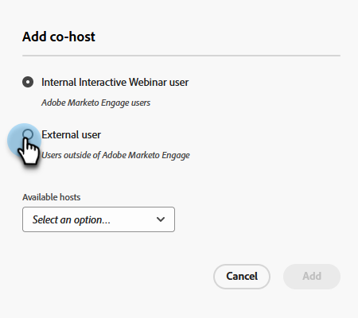

# 添加网络研讨会团队 {#add-a-webinar-team}

交互式网络研讨会中的网络研讨会团队包含所有有助于在Adobe Connect中成功举办网络研讨会的角色。 这包括演示者和联合主机。

>[!NOTE]
>
>在Adobe Connect的网络研讨会交付过程中，Marketo中的演示者和联合主机将完全映射到演示者和主持者的角色。

演示者是参与提供网络研讨会体验的外部角色，而共同主持人可以充当演示者并处理网络研讨会交付的管理问题。 联合主机可以是内部主机，也可以是外部主机。 外部联合主机将无法访问Marketo中的交互式网络研讨会活动程序，但在Adobe Connect中进行交付期间拥有主机权限。 内部联合主机在交付期间将有权访问Marketo中的交互式网络研讨会活动计划以及主机权限。 当交互式网络研讨会计划的原始创建者不再隶属于交互式网络研讨会用户集，甚至不再是Marketo用户时，这有助于确保内部联合主持人可以掌管交互式网络研讨会事件计划。

>[!PREREQUISITES]
>
>[创建交互式网络研讨会](/help/marketo/product-docs/demand-generation/events/interactive-webinars/create-an-interactive-webinar.md)

## 添加联主机 {#add-a-co-host}

1. 在交互式网络研讨会的“概述”页面中，单击 **添加联主机**.

   

1. 您可以添加内部或外部用户。 在本例中，我们将选择外部。

   

   >[!NOTE]
   >
   >如果您选择 **内部交互式网络研讨会用户**，您只需单击 **可用主机** 下拉列表，然后从已添加为Marketo Engage中的交互式网络研讨会用户的用户列表中选择。

1. 输入所需共同主机的名字、姓氏和电子邮件地址。 单击 **添加**.

   

1. 您的新联合主持人将显示在网络研讨会团队部分。

   

## 添加演示者 {#add-a-presenter}

1. 在交互式网络研讨会的“概述”页面中，单击 **添加演示者**.

   

1. 输入所需演示者的名字、姓氏和电子邮件地址。 单击 **添加**.

   

   >[!NOTE]
   >
   >演示者的信息将在网络研讨会交付过程中提供给Adobe Connect，以便用户可以在网络研讨会交付过程中自动填充相应的详细信息，而无需输入这些信息。

1. 您的新演示者将显示在“网络研讨会团队”部分。

   

>[!TIP]
>
>添加网络研讨会团队后，您可以单击每个用户旁边的复制图标以复制（然后共享）其加入URL。

>[!MORELIKETHIS]
>
>[创建交互式网络研讨会](/help/marketo/product-docs/demand-generation/events/interactive-webinars/create-an-interactive-webinar.md)
