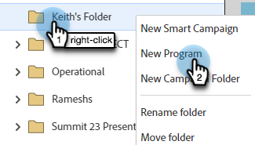

# 创建交互式网络研讨会 {#create-an-interactive-webinar}

通过几个简单的步骤创建交互式网络研讨会。

1. 转到 **营销活动**.

   

1. 右键单击所需的文件夹并选择 **新建项目群**.

   

1. 命名项目。 在项目类型下，选择 **事件**.

   

1. 单击渠道下拉菜单并选择 **网络研讨会**.

   

1. 选择 **交互式网络研讨会** 并单击 **下一个**.

   

   >[!NOTE]
   >
   >有关合作伙伴网络研讨会的信息可在此处找到。

1. 设置网络研讨会的最大受众规模以及持续时间。

   

1. 安排网络研讨会的日期/时间并单击 **创建**.

   

将创建交互式网络研讨会。 现在，是时候 [设计](/help/marketo/product-docs/demand-generation/events/interactive-webinars/designing-interactive-webinars.md).

