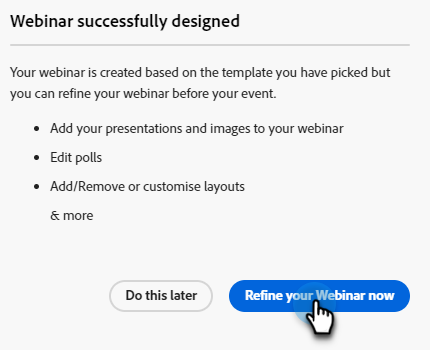

# 设计交互式网络研讨会 {#designing-interactive-webinars}

了解如何根据您的需求设计网络研讨会。

1. 选择您的事件并单击 **设计您的网络研讨会**.

   

1. 您可以选择现有的网络研讨会会议室，也可以创建一个新会议室。 在本例中，我们将创建一个新实例，因此请单击 **选择会议室** 下拉菜单并选择 **新建交互式网络研讨会室**.

   

   >[!NOTE]
   >
   >会议室是用于进行会议的在线空间。

1. 选择一个模板。

   

1. 将会显示您的网络研讨会预览。

   

1. 您可以选取不同的布局进行预览。 要继续，请单击 **使用模板**.

   

1. 您可以立即或稍后优化网络研讨会。 现在开始吧。 单击 **立即优化您的网络研讨会**.

   

1. 选择您的音频/视频首选项，然后单击 **进入会议室**.

   

1. 您选择的模板现在可以编辑。

   

1. 有关会议室和模板的详细信息，请参阅的“会议室模板和布局”部分。 [此Adobe帮助文章](https://helpx.adobe.com/in/adobe-connect/using/creating-arranging-meetings.html#creating_and_arranging_meetings){target="_blank"}.

1. 设计完网络研讨会后，单击 **退出室**.

   

## 设计元素 {#design-elements}

**模板**：根据网络研讨会的目标向会议室提供的结构。 例如，如果您要安排一次产品展示网络研讨会，则屏幕共享将是展示演示的重要组成部分。 该模板确保在网络研讨会室配置期间有效举办特定类型网络研讨会所需的基本组件就位。

**版面**：指为确保网络研讨会成功而需要的多个组件以各种方式安排在特定模板中。 单个模板可以有多个布局供您选择。 网络研讨会的主要内容在各模板上保持不变。 您选择的安排最适合您或网络研讨会演示者的风格/需求。

**Pod**：在网络研讨会期间执行特定活动的模板内的组件。 例如，设置并投放投票以在一个活动中捕获参与者的响应，该活动可以由投票面板完成。 同样，与参与者聊天以传达消息或者与参与者随意互动也可以是通过聊天面板传递的活动。 提供了多个其他Pod，例如“共享”、“注释”、“视频”、“聊天”、“与会者列表”、“文件”、“Web链接”、“投票”和“问答”。
