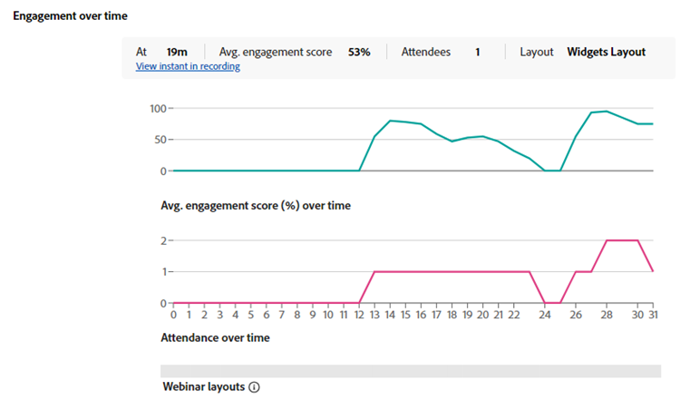
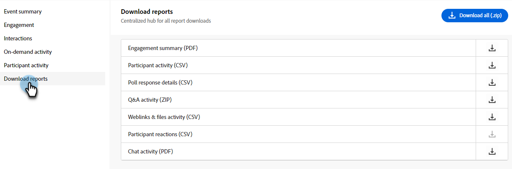

# 参与仪表板 {#engagement-dashboard}

由Adobe Connect提供支持的交互式网络研讨会使用各种pod让参与者参与聊天、问答、测验和投票。 通过参与度仪表板，可跟踪关键量度和数据可视化。

查看事件期间参与者活动、交互和参与情况的综合视图。 作为主持人，您可以查看实时和按需事件的性能并在会话后下载各种报告。 此外，从仪表板生成的网络研讨会后报告用于评估会议的有效性、为未来内容提供信息以及改进整体网络研讨会策略。

仪表板跟踪各种量度，包括投票回复、聊天活动和视频交互，为参与者的偏好和行为提供有价值的分析。 它全面概述了参与者的活动和参与级别，允许主机监控实时出席情况、参与情况和交互情况。

在交互式网络研讨会中查看以下类型会议的参与情况。

* **实时会话**：实时在线会话，参与者可以在此会话中主动相互交流。
* **按需会话**：实时活动的录制已作为自己的活动提供。 新受邀者可以注册并观看录音。 在注册之后，他们将收到一个事件加入链接，该链接会在活动结束后将它们带入事件的录制。 注册参加现场活动的参与者还可以使用相同的加入链接查看录制。

## 查看仪表板 {#view-the-dashboard}

1. 转到&#x200B;**[!UICONTROL 营销活动]**。

   

1. 选择所需的事件。

   

1. 在概述中，单击&#x200B;**[!UICONTROL 查看参与仪表板]**。

   

   >[!NOTE]
   >
   >在计划事件结束后45到120分钟内，可访问参与仪表板。

## 仪表板详细信息 {#dashboard-details}

您可以在参与仪表板中查看以下详细信息。

<table><tbody>
  <tr>
    <td><b>事件摘要</td>
    <td>提供实时和按需会议性能的综合视图。</td>
  </tr>
  <tr>
    <td><b>参与度</td>
    <td>提供实时会话性能的概述。</td>
  </tr>
  <tr>
    <td><b>交互</td>
    <td>提供参与者跨Pod参与的详细视图。</td>
  </tr>
  <tr>
    <td><b>按需活动</td>
    <td>提供录制性能的摘要。</td>
  </tr>
  <tr>
    <td><b>参与者活动</td>
    <td>提供整合的参与视图。</td>
  </tr>
  <tr>
    <td><b>下载报表</td>
    <td>下载不同Pod中的参与报表。</td>
  </tr>
</tbody>
</table>

### 事件摘要 {#event-summary}

此界面提供实时和按需会议活动性能的综合视图。 从左侧面板中，选择事件摘要以查看整体量度。

<table><tbody>
  <tr>
    <td><b>注册总数</td>
    <td>这显示了注册活动的参与者数量。</td>
  </tr>
  <tr>
    <td><b>与会者总数</td>
    <td>该图显示了参加活动的参与者人数。</td>
  </tr>
  <tr>
    <td><b>与会者注册转换率</td>
    <td>这显示了注册并参加活动的参与者的百分比。</td>
  </tr>
  <tr>
    <td><b>查看者都出席了实时和按需会议</td>
    <td>它会显示参加实时和按需活动的参与者数量。</td>
  </tr>
</tbody>
</table>

### 参与度 {#engagement}

提供活动实时会话性能的概述。 该概述包括关键量度、一段时间内的参与度和参与者交互。 它有助于组织者评估活动是否成功并确定需要改进的方面。

从左侧面板中，选择&#x200B;**[!UICONTROL 参与]**&#x200B;以查看实时会话的性能。 **[!UICONTROL 单击参与摘要(PDF)]**&#x200B;以下载实时会话的性能摘要。 概述以不同的部分提供数据。

**关键量度**

查看实时会话中的注册数、出席人数和参与度。

<table><tbody>
  <tr>
    <td><b>注册</td>
    <td>查看实时会话的注册数。</td>
  </tr>
  <tr>
    <td><b>与会者</td>
    <td>查看实时会话中的参与者数量。</td>
  </tr>
  <tr>
    <td><b>高度参与</td>
    <td>查看在实时会话期间高度参与并可能成为顶级潜在客户的参与者数量。</td>
  </tr>
  <tr>
    <td><b>适度参与</td>
    <td>查看实时会话中适度参与的参与者数量。
     <b>注意</b>：这些数字是根据会话期间的参与和交互计算的。</td>
  </tr>
  <tr>
    <td><b>观看平均持续时间（分钟）</td>
    <td>显示实时会话的平均观看持续时间（以分钟为单位）。</td>
  </tr>
</tbody>
</table>

**一段时间内的参与度**

通过参与度图表了解实时会话期间一段时间的平均参与度。 主机可以监测参与度水平如何波动，从而识别高交互或低交互的关键时刻。 查看不同布局的参与参与参与者的平均参与度得分情况。

通过将鼠标悬停在图形上，查看以下信息：

* 监视参与度级别的时间。
* 当时的平均参与度分数。
* 当时参与的与会者数量。
* 当时的预订布局。
* 选择&#x200B;**[!UICONTROL 在录制中查看即时]**&#x200B;以查看参与度高或低的录制中的即时。
* 会话中一段时间的平均参与度分数(%)
* 会话期间一段时间内的出席情况
* 当活动期间在会议室中使用不同的版面时，会显示不同网络研讨会版面的参与情况。 它有助于关联不同布局中参与度的上升和下降。

**与会者交互**

您可以从不同的Pod查看与会者的交互。 它提供已回答的投票、提问、与聊天交互、单击至少一个链接以及下载至少一个文件等信息。

选择&#x200B;**[!UICONTROL 转到交互]**&#x200B;以查看会话期间来自轮询、QnA量度和与会者反应的响应。 从交互中查看与会者在Pod中的参与情况，并从以下部分下载交互报表。

### 交互 {#interactions}

通过交互查看与会者如何交互并参与会话。 跟踪对轮询、QnA量度、与会者的反应以及相应Pod中删除的链接和文件的响应。 主机还可以下载这些Pod的交互报表，以便更好地进行分析。 通过分析这些交互，您可以确定趋势并调整其策略，以鼓励营造更具交互性和更引人入胜的环境。

从左侧面板中选择&#x200B;**[!UICONTROL 交互]**&#x200B;以查看与会者如何跨Pod参与。

从菜单栏选择&#x200B;**[!UICONTROL 轮询]**&#x200B;选项卡以查看添加到轮询的问题和响应。 此选项卡显示以下信息：

* 选择&#x200B;**[!UICONTROL 轮询报告(CSV)]**&#x200B;以下载轮询面板中交互的报告。
* 轮询问题及其类型。
* 响应数量和轮询面板打开和参与的时段。
* 选择&#x200B;**查看所有`<number>`响应**&#x200B;以在对话框窗口中查看它们。

从菜单栏中选择&#x200B;**[!UICONTROL 其他交互]**&#x200B;选项卡以查看其他Pod中的参与并下载其报告。

从下拉列表中选择&#x200B;**[!UICONTROL 下载交互报表]**&#x200B;以下载不同pod的报表。 从此处下载问题与解答报表、链接和文件报表以及反应报表，以便更好地跟踪。

不同部分提供了跨Pod的参与信息。

**QnA量度**

查看Q&amp;A面板的以下属性。

* 提问的总数。
* 未回答的问题数。
* 提出问题的与会者数量。
* 提出多个问题的与会者人数，其中谁有可能是最佳潜在客户。
* 回答问题所用的平均时间。

**反应**

在此观看与会者的反应，如同意、不同意、掌声和开怀大笑。

从反应图形中，查看以下详细信息：

* 反应总数
* 至少响应一次的与会者数
* 总点击次数
* 独特与会者
* 基于独特出席者总点击量的反应点击趋势。

**Web链接pod**

查看会话期间添加到Web链接面板的链接以及共享链接的点击次数。 网络链接面板允许您从网络研讨会之外的来源添加链接以产生参与。

从图形中，查看以下详细信息：

* 添加到Web链接面板的链接。
* 至少点击了一个链接的与会者数。
* 主机启动的链接数。
* 添加到Web链接面板的每个链接的唯一点击次数趋势。

**文件pod**

查看会话期间添加到文件面板的文件以及唯一下载的次数。 文件pod允许您添加文件并提供资源以产生参与。

从图形中，查看以下详细信息：

* 添加到文件面板中的文件的名称。
* 至少下载了一个文件的与会者数量。
* 每个添加到Web链接面板的文件的独特下载次数趋势。

### 按需活动 {#on-demand-activity}

从左侧面板中选择&#x200B;**[!UICONTROL 按需活动]**&#x200B;以查看录制摘要。 您还可以下载按需活动报表。

在按需活动中，查看以下量度：

* 单击&#x200B;**[!UICONTROL 按需报表(CSV)]**&#x200B;以下载按需量度。
* 上次刷新仪表板之前的独特查看者数量。
* 观看了录像但未能参加网络研讨会的观看者数量。
* 参加网络研讨会并观看录像的观看者数量。 他们很可能成为头号潜在客户。
* 注册了按需会话的查看者数量。
* 录制的平均观看持续时间（以分钟为单位）。

### 参与者活动 {#participant-activity}

从左侧面板中选择&#x200B;**[!UICONTROL 参与者活动]**&#x200B;以查看有关每个参与者的参与级别的合并信息。 查看如何从参与者参与级别将此参与分类。 单击&#x200B;**[!UICONTROL 用户活动报告(CSV)]**&#x200B;可下载报告以进行更好的跟踪。

从表中查看以下详细信息：

* 每个参与者的参与级别。 您还可以将它们从高到低排序，反之亦然。
* 参与者参加会议的持续时间。
* 参与者应答的投票。
* 参与者从文件面板下载的文件。
* 参与者从Web链接面板单击的链接。
* 参与者在QnA面板中提出的问题。

### 下载报表 {#download-reports}

从集中式中心作为主机下载不同活动和Pod的报告。

1. 从左侧面板中选择&#x200B;**[!UICONTROL 下载报表]**。

1. 选择&#x200B;**[!UICONTROL 全部下载(.zip)]**&#x200B;可一次性下载所有活动和pod的报表。

   

>[!NOTE]
>
>单击每个报表旁边的下载图标可单独下载它们。

## 参与者参与级别 {#participant-engagement-level}

企业使用Adobe Connect提供高度定制、品牌化和以参与为主导的网络研讨会。 投票、聊天、问答和反应等交互式工具有助于吸引与会者，并且收集不仅仅是注册和出席数据。 在与会者使用这些交互功能后，可使用参与数据将与会者分为三个参与级别：高、中和低。 您可以使用参与级别更新受众区段、更新人员得分和提醒销售人员。

了解对每个参与者的参与级别进行分类的标准：

<table><thead>
  <tr>
    <th>参与级别</th>
    <th>分类标准</th>
  </tr></thead>
<tbody>
  <tr>
    <td>高</td>
    <td>符合以下所有条件的参与者：
    <li>出席时间至少占总活动时间的80%。</li>
    <li>回答所有多选问题(MCQ)和多答(MA)投票，至少下载一个文件，或者张贴的聊天次数为5次或更多。</li>
    <li>与会者至少在问答面板中问了一个问题。</li></td>
  </tr>
  <tr>
    <td>媒介</td>
    <td>符合以下所有条件的参与者：
    <li>未确定参与者的参与程度过高。</li>
    <li>出席时间至少占总活动时间的60%。</li>
    <li>与会者已执行以下操作中的至少一个：
    <ul>
    <li>至少回答了一个投票。
    <li>在问答面板中至少询问了一个问题。<li>已下载至少一个文件。
    <li>已单击（但未启动）至少一个Web链接。<li>张贴了三个或更多聊天。</ul></li>
    </td>
  </tr>
  <tr>
    <td>低</td>
    <td>所有参与者均未被分类为高级或中级。</td>
  </tr>
</tbody></table>
