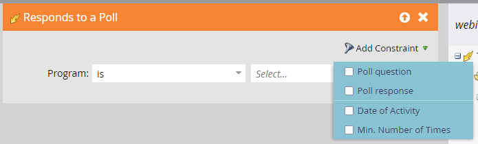

# 事件工作流 {#event-workflows}

网络研讨会完成后，转到“功能板”选项卡以查看汇总后的性能。

>[!NOTE]
>
>如果网络研讨会尚未完成或由于任何原因尚未收到数据，则“功能板”选项卡将不可用。

## 仪表板小组件 {#dashboard-widgets}

“仪表板”包含四个构件。

**事件计划状态**：显示该事件的各种项目群状态，以及当前保存该项目群状态值的项目群成员数量。

**出席情况**：以百分比的形式重点显示参加网络研讨会的各种成员的出席时间与整个网络研讨会时间的对比。

**轮询性能**：显示网络研讨会期间由Adobe Connect发起的各种投票，以及在每个答案中参加投票并作出回应的成员分布。

**单击并文件下载活动**：提供在网络研讨会期间，由Adobe Connect提供支持的、由参加网络研讨会并执行该特定操作的各个成员单击的文件和网络链接的下载计数。

## 网络研讨会录像 {#webinar-recording}

转到“概述”选项卡，查看录制的网络研讨会，获取共享该研讨会的链接，甚至下载副本。

>[!NOTE]
>
>* 交互式网络研讨会不会自动录制。 网络研讨会开始后，单击网络研讨会名称旁边的下拉菜单并选择 **录制会话**.
>* 录制以MP4格式下载。
>* 在共享录制时，拥有链接的任何人都可以查看，因此请确保与预期受众共享。

## 触发器和过滤器 {#triggers-and-filters}

使用与交互式网络研讨会相关的触发器和过滤器来查找事件程序中的特定人员组。

每个触发器/过滤器都附带其他约束，使您能够捕获该组的集中子集。

**在活动期间提出问题** （过滤器版本：在活动期间询问过问题）

**出席活动** （过滤器版本：已出席活动）

**链接点击次数** （过滤器版本：已单击链接）

**下载资产** （过滤器版本：已下载资源）

**响应投票** （筛选器版本：已响应投票）

