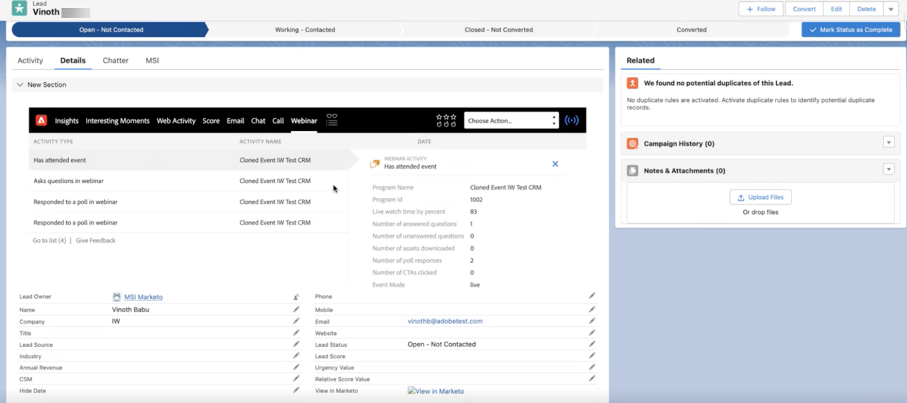

# msi {#msi}

交互式网络研讨会的CRM同步功能使您的网络研讨会活动可在Salesforce的Marketo Sales Insight (MSI)插件中使用。

>[!PREREQUISITES]
>
>仅已购买[Marketo Sales Insight](https://business.adobe.com/products/marketo/sales-intelligence-engagement.html)加载项的人员支持此功能。

活动在Marketo Engage中注册后(在Adobe Connect中完成网络研讨会后)，将通过MSI插件实时同步到Salesforce。

Marketo Engage中可用的每个活动都会同步。 这些活动包括：

* 出席活动
* 响应投票
* 回答问题
* 单击链接
* 下载资产

销售人员还可以查看这些活动的所有相关属性，并对各个潜在客户执行相应的操作。 活动信息可在通用的Insights部分以及单独的网络研讨会选项卡中获取。

在“见解”部分中，潜在客户时间线图表包含另一个网络研讨会泳道，其中突出显示过去90天每周同步的活动。 当选择特定的一周时，活动每天都会显示在单独的部分中。 您可以展开单个活动以查看其详细信息。

{width="800" zoomable="yes"}

在单独的网络研讨会选项卡中，所有活动（及其日期）也以表格形式列出。

{width="800" zoomable="yes"}
