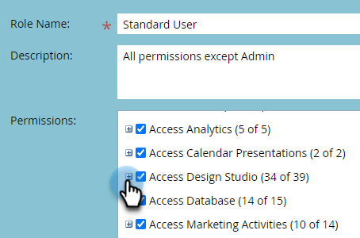

# 交互式网络研讨会模板 {#templates-for-interactive-webinars}

在交互式网络研讨会中创建易于使用的模板，以便在团队中工作时更快地制作内容并符合品牌准则。

## 创建模板 {#create-a-template}

1. 在Marketo Engage中，单击&#x200B;**[!UICONTROL 设计工作室]**。

   

1. 单击&#x200B;**[!UICONTROL 交互式网络研讨会]**。

   

1. 单击&#x200B;**[!UICONTROL 管理模板]**。

   

1. 此时将打开一个新选项卡。 单击&#x200B;**新建**。

   

1. 在“标准模板”选项卡中，选择所需的模板并单击&#x200B;**下一步**。

   

   >[!NOTE]
   >
   >组织模板是您或您的团队已创建的模板。

1. 输入名称和说明。 单击&#x200B;**保存并打开**。

   

1. 此时将打开一个新选项卡。 要编辑/保存模板，您必须进入文件室。 由于这不是实际的网络研讨会室，因此无需进行音频/视频选择。 单击&#x200B;**进入会议室**。

   

1. 对现有模板进行任何所需的更改。

   

1. 在右上角的“退出”菜单中，选择&#x200B;**为所有**&#x200B;结束会话。

   

1. 单击&#x200B;**立即结束**。

   

您的模板将自动保存。

## 编辑模板 {#edit-a-template}

执行以下步骤以编辑现有模板。

1. 在Marketo Engage中，单击&#x200B;**[!UICONTROL 设计工作室]**。

   

1. 单击&#x200B;**[!UICONTROL 交互式网络研讨会]**。

   

1. 单击&#x200B;**[!UICONTROL 管理模板]**。

   

1. 此时将打开一个新选项卡。 找到要编辑的模板并单击打开图标。

   

1. 此时将打开一个新选项卡。 要编辑您的模板，您必须进入文件室。 由于这不是实际的网络研讨会室，因此无需进行音频/视频选择。 单击&#x200B;**进入会议室**。

   

1. 对模板进行所需的更改。

   

1. 在右上角的“退出”菜单中，选择&#x200B;**为所有**&#x200B;结束会话。

   

1. 单击&#x200B;**立即结束**。

   

您的更改会自动保存。
