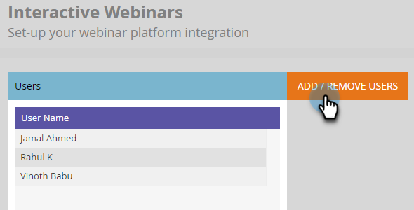
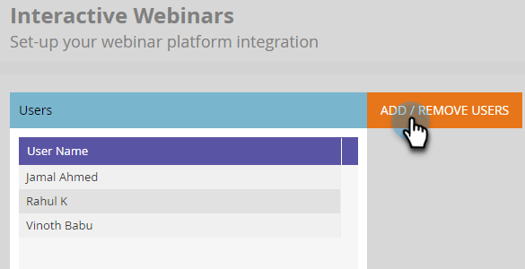

# 用户和许可证管理 {#user-and-license-management}

了解如何添加和删除用户以及查看您的当前许可证。

## 添加用户 {#add-a-user}

1. 转到 **管理员** 的上界。

   

1. 单击 **交互式网络研讨会**.

   

1. 单击 **添加/删除用户**.

   

1. 单击可用用户下拉列表，选择要添加的用户，然后单击 **确定**.

   

## 删除用户 {#remove-a-user}

1. 转到 **管理员** 的上界。

   

1. 单击 **交互式网络研讨会**.

   

1. 单击 **添加/删除用户**.

   

1. 选中要删除的用户，然后按键盘上的Delete键。 单击 **确定** 完成时。

   

## 许可证使用情况 {#license-usage}

交互式网络研讨会提供了用于创建Adobe Connect事件的特定许可证。 每次添加许可证时，都会显示一个新的许可证使用框。 Marketo管理员可以按照以下步骤查看（不编辑）许可证。 请联系Adobe客户团队（您的客户经理）以获取其他许可证。

1. 转到 **管理员** 的上界。

   

1. 单击 **交互式网络研讨会**.

   

1. 向下滚动到许可证使用卡。

   

<table> 
  <tr> 
   <td><b>开始日期</b></td>
   <td>许可证开始的日期。</td>
  </tr>
  <tr> 
   <td><b>到期日</b></td>
   <td>许可证的过期日期。</td>
  </tr>
  <tr> 
   <td><b>类型</b></td>
   <td>购买的许可证类型。 有三种类型可用：共享事件许可证、共享室许可证、其他存储许可证。</td>
  </tr>
  <tr> 
   <td><b>事件容量</b></td>
   <td>可在活动中容纳的最大参与者数。</td>
  </tr>
  <tr> 
   <td><b>事件总数</b></td>
   <td>已使用此许可证设置的事件总数。</td>
  </tr>
  <tr> 
   <td><b>使用的事件</b></td>
   <td>已完成事件的总数。</td>
  </tr>
  <tr> 
   <td><b>存储容量</b></td>
   <td>可用于存储记录、抵押品、hero images、文档和其他资产的存储量。</td>
  </tr>
  </tbody>
</table>

**注意事项**

* “其他存储许可证”类型只提供存储，因此每个字段中的值都是 _除外_ 存储容量将仅列为“ — ”。

* “共享室许可证”类型具有无限的事件，而“其他存储许可证”仅提供存储，因此这些许可证的“事件总数”字段将仅列为“ — ”。

* 每次创建事件时，它都将从其相应的许可证中计为“已使用”（除非它是共享室许可证）。 如果“共享事件许可证”和“共享文件室许可证”都具有相同容量，则将优先使用“共享事件许可证”。 如果事件尚未提交，并且在计划时间之前删除了事件程序，则通过减去已冲减事件中的事件来补充事件计数。

* 许可证用尽后，其磁贴会保留在管理员的交互式网络研讨会屏幕上，且使用的事件和事件总数具有相同的值。 只有当许可证过期时，才会将其从屏幕中删除。
