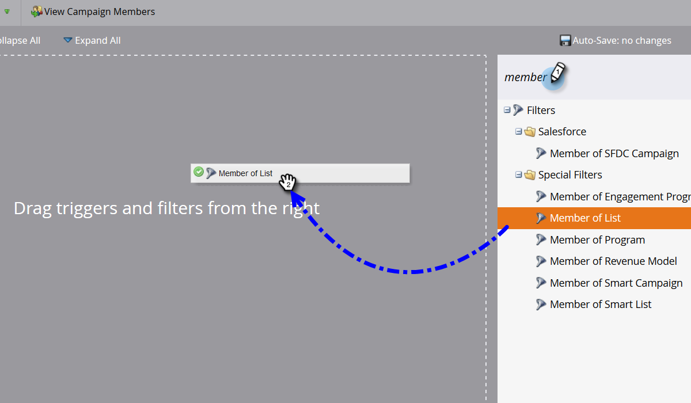
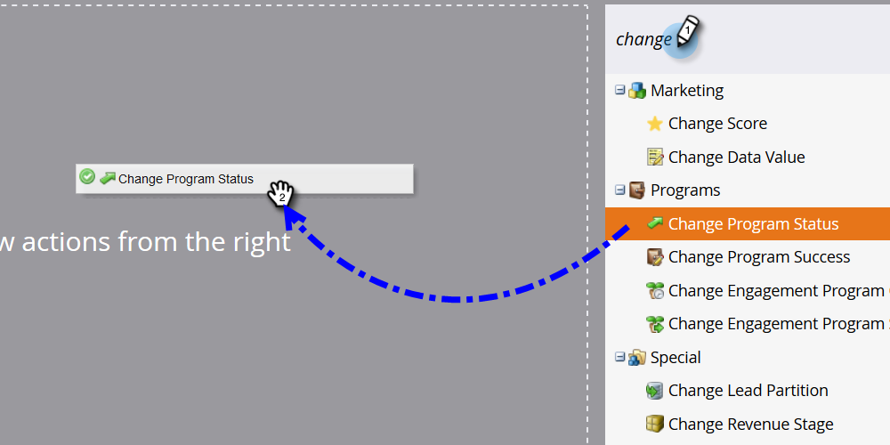

# 向事件程序添加成员 {#adding-members-to-an-event-program}

本文仅适用于使用事件上限或事件目标的用户。

>[!CAUTION]
>
>将人员列表直接导入事件程序将阻止这些记录被计入目标跟踪报表和事件上限进度报表中的实际注册中。 请按照以下说明确保记录被计数。

1. 创建和 [将人员添加到静态列表](/help/marketo/product-docs/core-marketo-concepts/smart-lists-and-static-lists/static-lists/create-a-static-list.md).

1. [创建智能营销活动](/help/marketo/product-docs/core-marketo-concepts/smart-campaigns/creating-a-smart-campaign/create-a-new-smart-campaign.md).

1. 在您在步骤2中创建的智能营销活动的智能列表中，查找并添加 **列表成员** 过滤器。

   

1. 查找并选择在步骤1中创建的列表。

   

1. 在流程中，查找并添加 **更改程序状态** 流步骤。

   

1. 查找并选择您的事件项目。

   

1. 选择所需的状态。

   

1. 在计划选项卡中，单击 **运行一次**.

   

1. 选择 **立即运行** 单击 **运行**.

   

1. 智能营销活动运行后，会将成员添加到项目，并将在“目标跟踪”和“事件上限进度”计算中进行计数。
