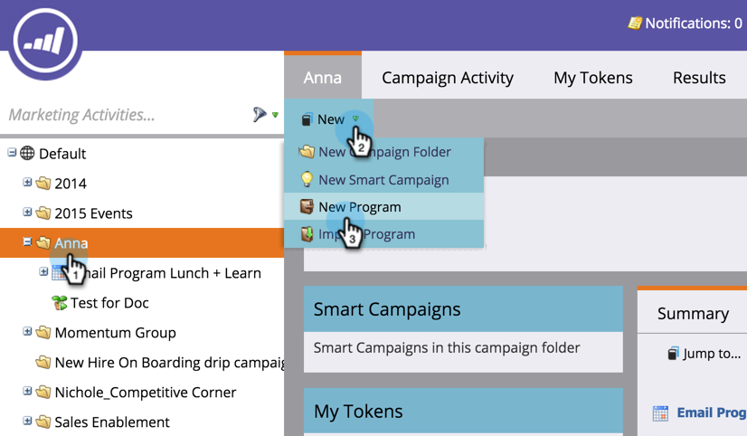

# 创建新的事件程序 {#create-a-new-event-program}

事件允许您自动执行在线和离线事件！ 捕获您的人员在不同阶段进展时的状态，并准确衡量您的营销计划的ROI。

1. 转到 **营销活动**.

   

1. 为新项目选择文件夹。 选择 **新建** 并单击 **新建项目群**.

   

1. 为您的事件选择一个名称。 然后，在下 **项目类型**，选择 **事件**.

   

1. 选择 **渠道**.

   >[!NOTE]
   >
   >渠道定义了人员在一个项目中可以具有的不同状态。 了解有关 [计划会员资格](/help/marketo/product-docs/core-marketo-concepts/programs/creating-programs/understanding-program-membership.md) 此处。

   

1. 单击&#x200B;**创建**。

   

   太棒了！ 您的新事件现在将显示在树中。

   

1. 要计划您的活动，请选择 **计划视图** 然后在日历中单击该图标以打开弹出窗口。 输入日期和时间。

   

1. 将栏滑动到 **已确认** 等你完事了。

   

创建事件后，构建 [登陆页面](/help/marketo/product-docs/demand-generation/landing-pages/free-form-landing-pages/create-a-free-form-landing-page.md)， [表单](/help/marketo/product-docs/demand-generation/forms/creating-a-form/create-a-form.md)、和 [电子邮件](/help/marketo/product-docs/email-marketing/email-programs/creating-an-email-program/create-an-email-program.md) 邀请您的嘉宾！ 您还需要熟悉 [项目计划视图](https://docs.marketo.com/display/docs/program+schedule+view).

>[!MORELIKETHIS]
>
>* [营销日历](/help/marketo/product-docs/core-marketo-concepts/marketing-calendar/understanding-the-calendar/navigating-the-marketing-calendar.md)
>* [在项目中使用期间成本](/help/marketo/product-docs/core-marketo-concepts/programs/working-with-programs/using-period-costs-in-a-program.md)
