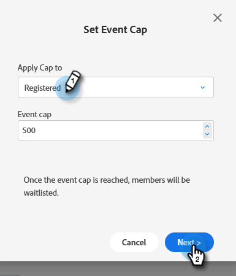

# 设置事件上限 {#setting-an-event-cap}

使用事件上限限制可注册您活动的人员数量。

>[!NOTE]
>
>并非每个人都购买了此功能。 有关详细信息，请联系Adobe客户团队（您的客户经理）。

>[!IMPORTANT]
>在设置事件上限之前，程序中必须至少具有两个已批准的登陆页面（注册页面和注册完整页面）。

>[!NOTE]
>
>要释放事件中的空间，必须删除程序成员（您可以通过将其状态更新为“不在程序中”来执行此操作）。

1. 选择您的事件程序。

   

1. 在概述中，查找 [!UICONTROL 事件数] 单击 **[!UICONTROL 未设置]**.

   

1. 输入您希望能够为活动注册的最大人数并单击 **[!UICONTROL 下一个]**.

   

1. 单击 [!UICONTROL 注册页面] 下拉菜单，然后选择将用作注册页面的登陆页面。

   

1. 单击 **[!UICONTROL 注册完整页面]** 下拉菜单，然后选择将用作注册完整页面的登陆页面。 单击 **[!UICONTROL 设置和启用]** 完成时。

   

   你都准备好了。 如果决定要编辑事件上限详细信息，请单击旁边的蓝色文本 [!UICONTROL 事件数].

   
