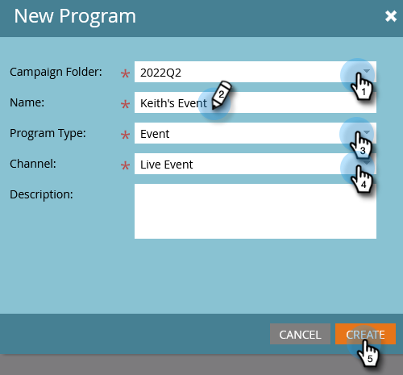

# 设置事件目标 {#setting-event-goals}

为事件指定特定目标并查看其执行情况。

>[!IMPORTANT]
>
>并非每个人都购买了此功能。 有关详细信息，请联系Adobe客户团队（您的客户经理）。

1. 创建事件程序。

   

1. 选择 [!UICONTROL Campaign文件夹]，为活动提供 [!UICONTROL 名称]，选择 [!UICONTROL 项目类型] 和 [!UICONTROL 渠道]. 单击 **[!UICONTROL 创建]** 完成时。

   

1. 在您的事件中，单击 **[!UICONTROL 报告]** 选项卡。

   

1. 输入目标 [!UICONTROL 已注册] 通过单击 **[!UICONTROL 设置目标]**. 在中键入数字，然后按Enter。

   

   

1. 对重复相同的步骤 [!UICONTROL 已参加].

   

>[!NOTE]
>
>事件开始后，您无法为事件设置目标。

就是这样！ 通过单击 [!UICONTROL 报告] 选项卡。
