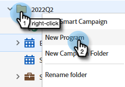
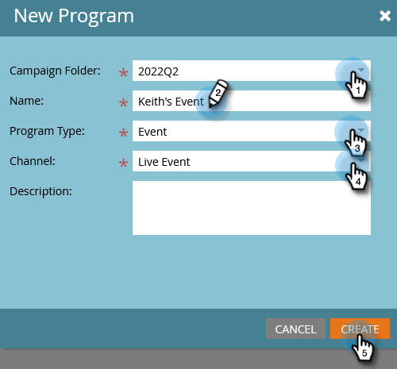

# 设置事件目标 {#setting-event-goals}

为事件指定特定目标并查看其执行情况。

>[!IMPORTANT]
>
>并非每个人都购买了此功能。 有关详细信息，请联系Adobe客户团队（您的客户经理）。

1. 创建事件程序。

   

1. 选择[!UICONTROL Campaign Folder]，为您的事件提供[!UICONTROL Name]，选择[!UICONTROL Program Type]和[!UICONTROL Channel]。 完成后，单击 **[!UICONTROL Create]**。

   

1. 在您的事件中，单击&#x200B;**[!UICONTROL Reports]**&#x200B;选项卡。

   

1. 通过单击[!UICONTROL Registered]输入&#x200B;**[!UICONTROL Set a goal]**&#x200B;的目标。 在中键入数字，然后按Enter。

   

   

1. 对[!UICONTROL Attended]重复相同的步骤。

   

>[!NOTE]
>
>事件开始后，您无法设置事件的目标。

就是这样！ 单击[!UICONTROL Reports]选项卡以检查您的事件目标状态。
