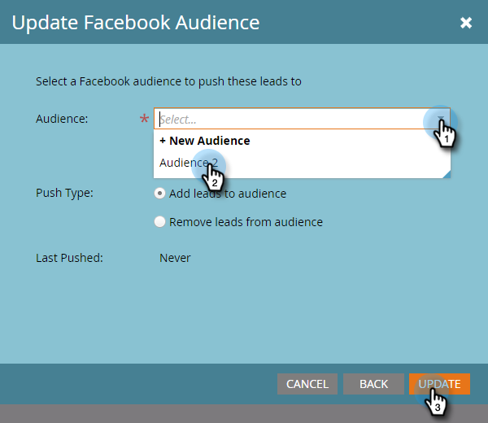

# 在Facebook中向自定义受众添加潜在客户 {#add-leads-to-a-custom-audience-in-facebook}

已在Facebook中拥有自定义受众，并想要向其添加更多潜在客户？ 这是方法。

>[!PREREQUISITES]
>
>* [在Facebook中创建自定义受众](/help/marketo/product-docs/demand-generation/facebook/create-a-custom-audience-in-facebook.md)
>* [接受Facebook的自定义受众条款](https://www.facebook.com/ads/manage/customaudiences/tos.php) 在您的Facebook帐户中。
>

1. 查找并选择包含要添加的潜在客户的智能或静态列表。

   

1. 选择 **潜在客户** ，然后单击 **通过广告桥发送** 图标。

   

1. 选择 **Facebook** 单击 **下一个**.

   

1. 单击 **受众** 下拉列表中，选择要将潜在客户添加到的受众，然后单击 **更新**.

   

   >[!NOTE]
   >
   >**向受众添加潜在客户**:只有具有自定义子类型的Facebook受众才可用。\
   >**从受众中删除潜在客户**:从Facebook受众中删除静态或智能列表中的潜在客户。

1. 完成后，状态将更新。

   

   就这样！

   >[!NOTE]
   >
   >[在Facebook中创建自定义受众](/help/marketo/product-docs/demand-generation/facebook/create-a-custom-audience-in-facebook.md)
