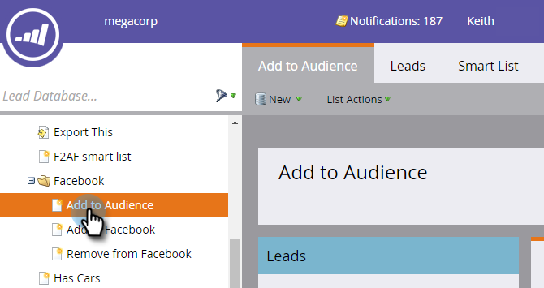

# 在Facebook中将潜在客户添加到自定义受众 {#add-leads-to-a-custom-audience-in-facebook}

在Facebook中已有自定义受众，并且想要为此添加更多潜在客户？ 具体方法如下。

>[!PREREQUISITES]
>
>* [在Facebook中创建自定义受众](/help/marketo/product-docs/demand-generation/facebook/create-a-custom-audience-in-facebook.md)
>* 在您的Facebook帐户中[接受Facebook的自定义受众条款](https://www.facebook.com/ads/manage/customaudiences/tos.php)。
>

1. 查找并选择包含要添加的潜在客户的智能或静态列表。

   

1. 选择&#x200B;**潜在客户**&#x200B;选项卡，然后单击底部的&#x200B;**通过广告Bridge发送**&#x200B;图标。

   

1. 选择&#x200B;**Facebook**&#x200B;并单击&#x200B;**下一步**。

   

1. 单击&#x200B;**受众**&#x200B;下拉列表，选择要将潜在客户添加到的受众，然后单击&#x200B;**更新**。

   

   >[!NOTE]
   >
   >**将潜在客户添加到受众**：将只有具有自定义子类型的Facebook受众可用。\
   >**从受众中删除潜在客户**：从Facebook受众中删除静态或智能列表中的潜在客户。

1. 完成后，状态将更新。

   

   就这么多！

   >[!NOTE]
   >
   >[在Facebook中创建自定义受众](/help/marketo/product-docs/demand-generation/facebook/create-a-custom-audience-in-facebook.md)
