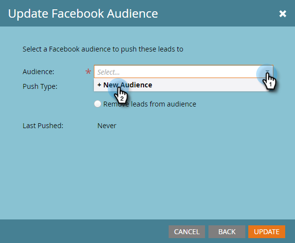

# 在Facebook中创建自定义受众 {#create-a-custom-audience-in-facebook}

>[!PREREQUISITES]
>
>* [将Facebook自定义受众添加为LaunchPoint服务](/help/marketo/product-docs/demand-generation/ad-network-integrations/add-facebook-custom-audiences-as-a-launchpoint-service.md)“管理员”部分中的{target=&quot;_blank&quot;}。
>* [接受Facebook的自定义受众条款](https://www.facebook.com/ads/manage/customaudiences/tos.php){target=&quot;_blank&quot;}。

>[!TIP]
>
>详细了解 [facebook中的自定义受众](https://www.facebook.com/help/341425252616329){target=&quot;_blank&quot;}。

1. 查找并选择智能或静态列表，其中包含您要从中创建受众的潜在客户。

   

1. 选择 **潜在客户** ，然后单击 **通过广告桥发送** 图标。

   

1. 选择 **Facebook** 单击 **下一个**.

   

1. 单击 **受众** 下拉框并选择 **+新受众**.

   

1. 键入 **受众名称**. 单击 **更新**.

   

   >[!NOTE]
   >
   >如果您有多个Facebook广告帐户，您将看到一个额外的下拉列表，允许您选择在其中创建此受众的广告帐户。

   >[!TIP]
   >
   >是否要将新受众与当前与广告集或群组关联的现有受众进行交换？ 选择 **替换现有受众** 复选框。 执行此操作将 **not** 删除要替换的受众。

1. 完成后，状态对话框将更新。

   

   就这样！ 在Facebook中，您将在 **广告管理器** > **受众**.

   

   >[!NOTE]
   >
   >推送到Facebook的所有列表都将变为静态列表。 Marketo中的智能列表不会自动更新Facebook中的受众列表，以反映在传输后所做的任何更改。

   >[!TIP]
   >
   >请参阅 [FacebookMarketo客户的学习之路](https://facebook.exceedlms.com/student/enrollments/create_enrollment_from_token/BF9TqSaCvM73PP4ScjhCm4fi){target=&quot;_blank&quot;}。 它涵盖您需要了解的所有信息，从创建Facebook页面，到使用Marketo的广告网络集成来定位Facebook广告。

   >[!MORELIKETHIS]
   >
   >[在Facebook中向自定义受众添加潜在客户](/help/marketo/product-docs/demand-generation/facebook/add-leads-to-a-custom-audience-in-facebook.md)
