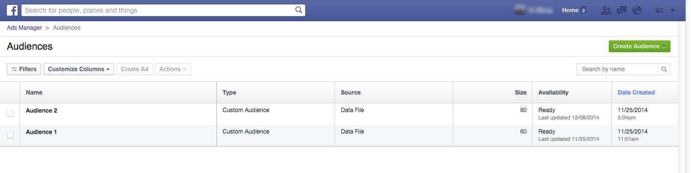

# 在[!DNL Facebook]中创建自定义受众 {#create-a-custom-audience-in-facebook}

>[!PREREQUISITES]
>
>* 在“管理员”部分中[添加 [!DNL Facebook] 自定义受众作为LaunchPoint Service](/help/marketo/product-docs/demand-generation/ad-network-integrations/add-facebook-custom-audiences-as-a-launchpoint-service.md){target="_blank"}。
>* 在您的[帐户中 [!DNL Facebook]接受](https://www.facebook.com/ads/manage/customaudiences/tos.php){target="_blank"}的自定义受众条件[!DNL Facebook]。

>[!TIP]
>
>详细了解[ [!DNL Facebook]中的](https://www.facebook.com/help/341425252616329){target="_blank"}自定义受众。

1. 查找并选择智能或静态列表，其中包含要从中创建受众的潜在客户。

   

1. 选择&#x200B;**[!UICONTROL Leads]**&#x200B;选项卡，然后单击底部的&#x200B;**通过广告Bridge发送**&#x200B;图标。

   

1. 选择 **[!UICONTROL Facebook]** 并点击 **[!UICONTROL Next]**。

   

1. 点击 **[!UICONTROL Audience]** 下拉菜单，并选择 **[!UICONTROL + New Audience]**。

   

   >[!IMPORTANT]
   >
   >Facebook API允许每个Facebook广告帐户最多500个自定义受众。

1. 键入&#x200B;**[!UICONTROL Audience Name]**。 单击 **[!UICONTROL Update]**。

   

   >[!NOTE]
   >
   >如果您有多个[!DNL Facebook]广告帐户，您将看到一个额外的下拉列表，允许您选择创建此受众的广告帐户。

   >[!TIP]
   >
   >是否要将新受众与当前与广告集或组关联的现有受众进行交换？ 选中&#x200B;**[!UICONTROL Replace an existing audience]**&#x200B;复选框。 执行此操作将&#x200B;**不**&#x200B;删除要替换的受众。

1. 完成后，状态对话框将更新。

   

   就是这样！ 在Facebook中，您将在&#x200B;**广告管理器** > **受众**&#x200B;中看到新受众。

   

   >[!NOTE]
   >
   >您推送到[!DNL Facebook]的所有列表都将变为静态。 Marketo中的智能列表不会自动更新[!DNL Facebook]中的受众列表以反映传输后所做的任何更改。

   >[!MORELIKETHIS]
   >
   >在[中 [!DNL Facebook]](/help/marketo/product-docs/demand-generation/facebook/add-leads-to-a-custom-audience-in-facebook.md)向自定义受众添加潜在客户
