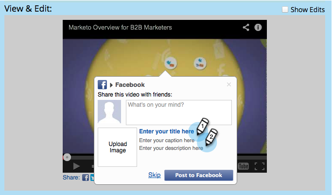

# 编辑Facebook富帖子设置 {#edit-facebook-rich-post-settings}

自定义用户在Facebook上共享您的帖子。

>[!AVAILABILITY]
>
>并非所有客户都已购买此功能。 有关详细信息，请与您的销售代表联系。

Marketo [社交应用程序](/help/marketo/product-docs/demand-generation/social/social-functions/add-a-social-button-on-a-landing-page.md) 允许您的潜在客户与其在Facebook、Twitter等社交网络上的连接共享您的登陆页面。 facebook OpenGraph标记（OG标记）允许您指定登陆页面中的哪些信息包含在Facebook帖子中。

## 选择富发布选项 {#select-rich-post-options}

您可以指定要在由登录页中的共享生成的Facebook富帖子中使用的页面信息类型。

1. 选择 **facebook消息** 在的编辑器中 **YouTube** 视频或社交按钮。

   

1. 从以下Facebook消息选项中进行选择。

   * 添加静态内容：选择此选项可手动输入标题、描述和描述。

   

   * 添加动态内容：您的社交应用程序可以使用登陆页面的 `<TITLE>`， `<CAPTION>`、和 `<DESCRIPTION>` 标记以填充您的富帖。

   

   >[!NOTE]
   >
   >这些标签应已存在于页面源中，但为了更好地控制，您可以向登陆页面添加特定的Facebook OG标签。

   * 请勿添加丰富的内容：将登陆页面中的Facebook帖子限制为仅添加主消息和链接。

   

## 将Facebook OG标记添加到登陆页面 {#add-facebook-og-tags-to-a-landing-page}

要通过登陆页控制将包含在Facebook共享中的页面元素，您可以向登陆页添加标题、描述和描述的Facebook OG（开放图形）标记。

1. 打开包含您的 **YouTube视频** 或社交按钮。

   

   此 **登陆页设计器** 将在新窗口中打开。

1. 选择 **登陆页面操作** > **编辑页面元标记**.

   

1. 添加定义og：title、og：caption和og：description的HTML。 复制并粘贴这些行并替换占位符文本：

   `<meta property="og:title" content="My Post Title"/>`

   `<meta property="og:caption" content="My Post Caption"/>`

   `<meta property="og:description" content="This text appears in the post description"/>`

   

>[!NOTE]
>
>在添加OGHTML时，请务必注意使用正确的标记语法。
