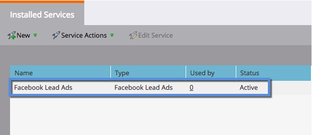

# 设置Facebook潜在客户广告 {#set-up-facebook-lead-ads}

使用[Facebook潜在客户广告](https://www.facebook.com/business/ads/ad-objectives/lead-generation){target="_blank"}在Facebook中运行广告营销活动并为Marketo生成潜在客户。

>[!NOTE]
>
>**需要管理员权限**

>[!AVAILABILITY]
>
>要将Facebook潜在客户广告添加到您的实例，请联系Adobe客户团队（您的客户经理）。

1. 在Marketo Engage中，转到&#x200B;**管理员**&#x200B;区域。

   

1. 转到&#x200B;**LaunchPoint**，单击&#x200B;**新建**&#x200B;下拉菜单并选择&#x200B;**新建服务**。

   

1. 为您的服务输入&#x200B;**显示名称**，从下拉列表中选择&#x200B;**Facebook潜在客户广告**&#x200B;服务，然后单击&#x200B;**创建**。

   

1. 在同一浏览器中打开一个新选项卡，然后转到[facebook.com](https://www.facebook.com){target="_blank"}。 使用您要用于集成的帐户登录Facebook。

   >[!NOTE]
   >
   >Facebook帐户将需要访问您想要从中提取潜在客户广告的所有Facebook业务页面。

   

1. 登录Facebook后，返回Marketo并单击&#x200B;**授权**。

   

1. 如果出现提示，请单击&#x200B;**确定**&#x200B;接受Marketo应用程序安装到Facebook中。

   

1. 您会发现您现在已获得授权。 单击&#x200B;**下一步**。

   

1. 选择您希望Marketo从中提取Facebook潜在客户广告的页面，然后单击&#x200B;**下一步**。

   >[!TIP]
   >
   >如果您没有看到预期的页面，请确保将用于身份验证的Facebook帐户已添加到Facebook的页面中，然后重试。

   

1. 要接受默认的Facebook到Marketo字段映射，只需单击&#x200B;**创建**。

   >[!TIP]
   >
   >通过修改映射，您可以自定义潜在客户广告数据在Marketo中的存储位置。 您也可以[从潜在客户广告自定义问题](/help/marketo/product-docs/demand-generation/facebook/set-up-facebook-lead-ads/map-custom-fields-to-marketo.md){target="_blank"}中提取数据。

   >[!CAUTION]
   >
   >Marketo不支持将两个Facebook字段映射到单个Marketo字段，仅支持从1到1。 如果将2映射到1，则潜在客户可能无法进入Marketo系统。

   

   做得好！ 当您成功开展Facebook潜在客户广告营销活动时，潜在客户将开始流入Marketo。

   

>[!MORELIKETHIS]
>
>* [在潜在客户访问管理器(Facebook)中分配/删除权限](https://www.facebook.com/business/help/540596413257598?id=735435806665862){target="_blank"}
>* [在智能营销活动中使用潜在客户广告过滤器和触发器](/help/marketo/product-docs/demand-generation/facebook/use-lead-ads-filters-and-triggers-in-a-smart-campaign.md){target="_blank"}
>* [将自定义字段映射到Marketo](/help/marketo/product-docs/demand-generation/facebook/set-up-facebook-lead-ads/map-custom-fields-to-marketo.md){target="_blank"}
