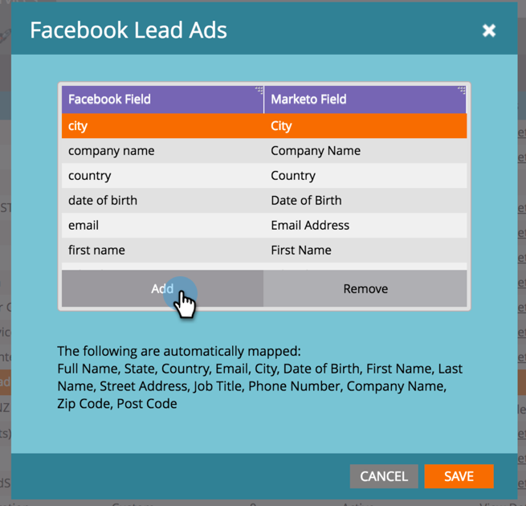

# 将自定义字段映射到Marketo {#map-custom-fields-to-marketo}

默认情况下，您可能希望收集的信息比Facebook存储的标准信息更多，例如某人使用您的在线交付服务的频率。 您可以通过以下方式完成此任务 [创建自定义问题](https://www.facebook.com/business/help/774623835981457?helpref=uf_permalink) 在您的Facebook潜在客户广告中。

但是， **Marketo不会自动开始收集此数据**. 为了让Marketo开始捕获自定义字段值，您可以 **必须** 将这些自定义字段映射到Marketo中的字段。

以下是在“管理”的LaunchPoint区域中设置此步骤的方法。

>[!NOTE]
>
>**需要管理员权限**

1. 转到“管理”区域并单击 **启动点**. 在“已安装的服务”下，查找并编辑 **facebook潜在客户广告**.

   

1. 单击 **下一个**.

   

1. 将授权帐户保持原样 — do **非** 进行任何更改。 单击 **下一个**.

   

1. 与以前一样，将所选页面保持原样 — 执行 **非** 进行任何更改。 单击 **下一个**.

   

1. 在这里，您可以将自定义Facebook字段映射到Marketo字段。 单击 **添加。**

   

1. 在新行中，输入Facebook自定义字段的名称。

   

   >[!NOTE]
   >
   >只有已保存到Facebook表单模板的字段才会在此处显示为选项。

1. 单击 **Marketo字段** 列。 键入以搜索要映射到的字段。 选择字段后，单击 **保存**.

   

   >[!NOTE]
   >
   >如果您在Marketo中尚没有字段可将Facebook字段映射到，请了解如何 [创建自定义字段](/help/marketo/product-docs/administration/field-management/create-a-custom-field-in-marketo.md).

>[!CAUTION]
>
>您 **必须** 对任何新的Facebook字段执行此过程，以便Marketo收集数据。
