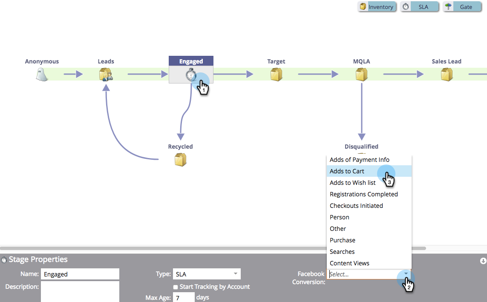

# 设置Facebook脱机转换 {#set-up-facebook-offline-conversions}

通过向Facebook发送线下转化数据，让通过Lead Ads创建的人群使用，您的广告团队可以比以往更好地优化其广告支出。 下面介绍如何设置。

>[!NOTE]
>
>**先决条件**
>
>* 必须设 [置Facebook潜在客户广告](set-up-facebook-lead-ads.md)。
>* 您必须在收入周期建模器中具 [有已批准的模型](http://docs.marketo.com/display/docs/revenue+cycle+models)。

>

## 管理员配置 {#admin-configuration}

1. 转到Marketto **Admin**。

   

1. 转到 **LaunchPoint** ，然后多次单击您之前创建的Facebook潜在客户广告服务。

   >[!NOTE]
   >
   >如果您还没有这样做，请继续 [设置Facebook潜在客户广告](set-up-facebook-lead-ads.md)，然后返回此处。

   

1. 如果需要，请编辑显 **示名称** ，以包括脱机转换。 单击“ **下一步**”。

   

1. 选中“ **启用脱机转换** ”，然后 **单击“下一步**”。

   

1. 单击“ **下一步**”。

   

1. 单击 **保存**。

   

   真贴心！ 您完成了启用Facebook脱机转换的一半。 让我们跳到收入周期建模器来映射各个阶段。

   

## 收入周期建模器配置 {#revenue-cycle-modeler-configuration}

1. 转到 **Analytics**。

   

1. 选取模型并单击“编 **辑拔模”**。

   

   >[!NOTE]
   >
   >目前，有10个Facebook事件可以将收入周期阶段映射到：
   >
   >    
   >    
   >    * 添加付款信息
   >    * 添加到购物车
   >    * 添加到愿望列表
   >    * 注册已完成
   >    * 已启动结帐
   >    * 人物
   >    * 其他
   >    * 购买
   >    * 搜索
   >    * 内容视图

1. 选择要映射的阶段，然后从“Facebook转 **化”下拉** 菜单中选择要将其映射到的Facebook事件。 重复此步骤，将RCM中的所有阶段映射到Facebook上的脱机转换阶段。

   

1. 完成映射后，关闭模型。

   

1. 批准您的模型，您就完成！

   

   现在，当潜在客户广告潜在客户到达您映射的阶段时，转化会发送到Facebook以供报告。

   >[!CAUTION]
   >
   >检查您的Facebook帐户，并确保所 [有广告都与](https://www.facebook.com/business/url/?href=%2Fbusiness%2Fhelp%2Fwww%2F1776828022605281&amp;cmsid&amp;creative=link&amp;creative_detail=advertiser-help-center&amp;create_type&amp;destination_cms_id&amp;orig_http_referrer) “Marketo Offline Conversions”事件集关联。 如果不是，广告归因可能不起作用。

   >[!NOTE]
   >
   >脱机转换数据每天从Market发送多次到Facebook。

>[!NOTE]
>
>**相关文章**
>
>* [了解Facebook脱机转换](understanding-facebook-offline-conversions.md)

>

