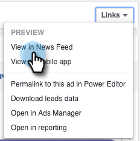

# 测试桌面版与Marketo集成的Facebook潜在客户广告 {#test-facebook-lead-ads-for-desktop-integration-with-marketo}

创建潜在客户广告后，您应该对其进行测试！ 以下是在您的桌面上执行此操作的方法。

>[!PREREQUISITES]
>
>您必须 [设置Facebook潜在客户广告集成](/help/marketo/product-docs/demand-generation/facebook/set-up-facebook-lead-ads.md).

1. 在Facebook功能编辑器中，选择营销策划、广告，然后单击 **编辑**.

1. 下 **链接**，单击 **在动态信息源中查看** 链接。

   

1. 您将在浏览器的新选项卡中被定向到Facebook。 单击Facebook潜在客户广告单元中的行动动员。

   

   >[!NOTE]
   >
   >这只是一个示例，它使用了解更多行动号召。 您的潜在客户广告单元行动号召可能不同。

1. 在桌面上填写表格以提交测试潜在客户广告单元。 单击 **提交**.

   

1. 恭喜！ 您已完成提交Lead Ad表单。

   

1. 这就是魔法发生的地方！ 一旦你提交了表格， [在Marketo中构建智能列表](/help/marketo/product-docs/core-marketo-concepts/smart-lists-and-static-lists/creating-a-smart-list/create-a-smart-list.md) 作为程序的一部分或在使用“填写的Facebook潜在客户广告表单”过滤器的数据库中。 插入您刚刚提交的表单的“潜在客户广告表单名称”。

   

1. 现在，单击 **人员** 选项卡，验证同步是否正常工作。

   

   这很酷还是什么？

>[!MORELIKETHIS]
>
>[设置Facebook潜在客户广告](/help/marketo/product-docs/demand-generation/facebook/set-up-facebook-lead-ads.md)
