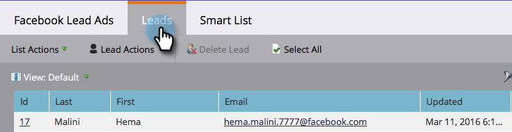

# 测试Facebook潜在客户广告以与Marketo进行移动集成 {#test-facebook-lead-ads-for-mobile-integration-with-marketo}

创建潜在客户广告后，您应该对其进行测试！

>[!PREREQUISITES]
>
>您必须 [设置Facebook潜在客户广告集成](/help/marketo/product-docs/demand-generation/facebook/set-up-facebook-lead-ads.md).

1. 在Facebook功能编辑器中，选择营销策划、广告，然后单击 **编辑**.

1. 下 **链接**，单击 **在移动应用程序上查看** 链接。

   

1. 将向您可在具有授权帐户的移动设备上访问的Facebook帐户发送新通知。 单击 **确定**.

   

1. 在您的移动设备上，点按 **通知** 在Facebook移动设备应用程序中。

   

1. 在通知中，点按 **您的广告已准备好预览**.

   

1. 通过点按行动号召并填写您创建的表单，提交您的测试潜在客户广告单元。

   

   >[!NOTE]
   >
   >这只是一个示例，它使用了解更多行动号召。 您的潜在客户广告单元行动号召可能不同。

1. 这就是魔法发生的地方！ 一旦你提交了表格， [在Marketo中构建智能列表](/help/marketo/product-docs/core-marketo-concepts/smart-lists-and-static-lists/creating-a-smart-list/create-a-smart-list.md) 作为程序的一部分或在使用 **填写了Facebook潜在客户广告表单** 筛选条件。 插入您刚刚提交的表单的“潜在客户广告表单名称”。

   

1. 现在，单击Leads选项卡以验证同步是否正常工作。

   

这很酷还是什么？

>[!NOTE]
>
>[启用/禁用Facebook潜在客户广告](/help/marketo/product-docs/demand-generation/facebook/set-up-facebook-lead-ads.md)
