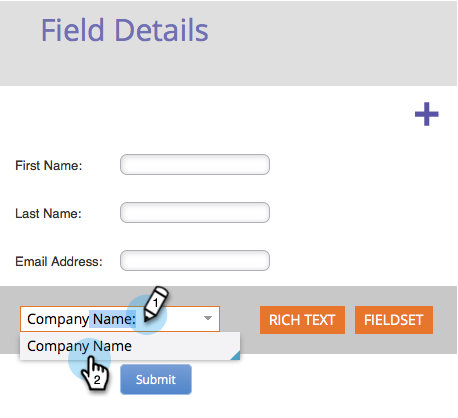

# 向表单添加字段 {#add-a-field-to-a-form}

在您[创建表单](/help/marketo/product-docs/demand-generation/forms/creating-a-form/create-a-form.md){target="_blank"}并[选择主题](/help/marketo/product-docs/demand-generation/forms/creating-a-form/select-a-form-theme.md){target="_blank"}后，您可能需要添加其他字段以供他人填写。 操作方法如下：

1. 前往 **[!UICONTROL Marketing Activities]**。

   

1. 选择您的表单并单击&#x200B;**[!UICONTROL Edit Draft]**

   

   >[!NOTE]
   >
   >如果所需表单处于&#x200B;_已批准_&#x200B;状态，则必须先单击&#x200B;**创建草稿**。

1. 在表单中，单击&#x200B;**+**&#x200B;号。

   

   >[!NOTE]
   >
   >创建新表单时，[!UICONTROL First Name]、[!UICONTROL Last Name]和[!UICONTROL Email Address]会自动添加。

1. 查找并选择要添加到表单中的字段。

   

1. 添加所需数量的字段，然后单击&#x200B;**[!UICONTROL Finish]**。

   

1. 单击 **[!UICONTROL Approve and Close]**。

   

>[!NOTE]
>
>请确保批准由于表单更改而创建的任何登陆页面草稿。

>[!MORELIKETHIS]
>
>[将表单字段设为必填](/help/marketo/product-docs/demand-generation/forms/creating-a-form/make-a-form-field-required.md){target="_blank"}
