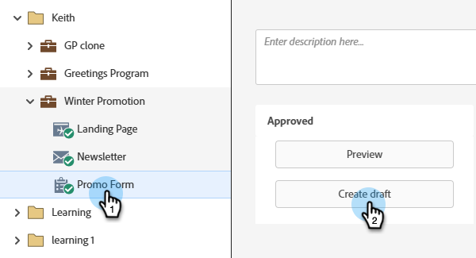

# 编辑表单中的字段标签 {#edit-a-field-label-in-a-form}

您可以将表单上的标签更改为任何内容 — 您甚至可以使用图像或完全擦除图像！ 下面是操作方法。

1. 转到&#x200B;**[!UICONTROL Marketing Activities]**。

   

1. 选择您的表单并单击&#x200B;**[!UICONTROL Create draft]**。

   

   >[!NOTE]
   >
   >如果您的表单未获得批准，请单击&#x200B;**编辑草稿**。

1. 选择您的字段，然后编辑&#x200B;**[!UICONTROL Label]**。 表单设置中的字段将反映您输入的标签。

   

   >[!TIP]
   >
   >单击图标以访问富文本编辑器。

1. 单击 **[!UICONTROL Finish]**。

   

1. 单击 **[!UICONTROL Approve and Close]**。

   

>[!NOTE]
>
>不要忘记[批准由表单更改创建的登陆页面草稿](/help/marketo/product-docs/demand-generation/landing-pages/understanding-landing-pages/approve-unapprove-or-delete-a-landing-page.md){target="_blank"}。
