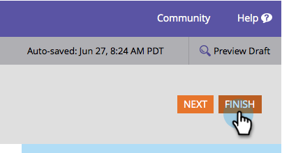

# 必填表单字段 {#make-a-form-field-required}

When [向表单添加字段](/help/marketo/product-docs/demand-generation/forms/creating-a-form/add-a-field-to-a-form.md) 你可能想让填写者做几个。 这是方法。

1. 转到 **营销活动**.

   

1. 选择您的表单并单击 **编辑表单**.

   

1. 选择要设为必填字段，然后选中必填。

   

1. 干得好！ 单击 **完成**.

   

1. 单击 **批准并关闭**.

   

>[!NOTE]
>
>别忘了 [批准任何登陆页面](/help/marketo/product-docs/demand-generation/landing-pages/understanding-landing-pages/approve-unapprove-or-delete-a-landing-page.md) 此表单会继续存在，以便让更改生效。

您是否需要 [对您添加到表单中的字段重新排序](/help/marketo/product-docs/demand-generation/forms/form-fields/reorder-fields-in-a-form.md)?
