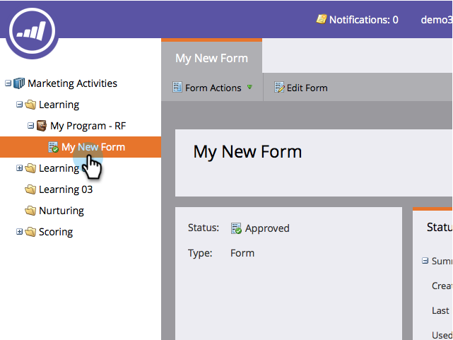

# 预览表单 {#preview-a-form}

在发布之前，您可以在此简单快速的表单预览器中查看表单。

1. 转到 **营销活动**.

   

1. 查找并选择您的表单。

   

1. 下 **表单操作**，单击 **预览**.

   

1. 将在中打开表单编辑器 **预览** 模式。

   

1. 单击 **编辑草稿** 以返回 **编辑** 模式。

   

1. 通过单击轻松切换回 **预览草稿**.

   

那不容易吗？ 现在，您知道如何在进行更改时预览表单。
