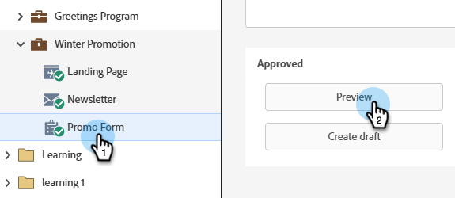

# 预览表单 {#preview-a-form}

在发布之前，您可以在此简单快速的表单预览器中查看表单。

1. 转到&#x200B;**[!UICONTROL Marketing Activities]**。

   

1. 选择您的表单并单击&#x200B;**[!UICONTROL Preview]**。

   

   >[!NOTE]
   >
   >如果您的表单未获得批准，请单击&#x200B;**预览草稿**。

1. 表单编辑器将在&#x200B;_预览_&#x200B;模式下打开。

   

1. 单击&#x200B;**[!UICONTROL Edit Draft]**&#x200B;以返回&#x200B;_编辑_&#x200B;模式。

   

1. 通过单击&#x200B;**[!UICONTROL Preview Draft]**&#x200B;可轻松切换回。

   
