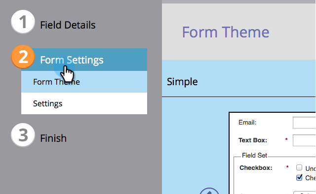

# 选择表单主题 {#select-a-form-theme}

我们为你的表格做了很多好主题。 你最喜欢哪个？

1. 转到 **营销活动**.

   

1. 选择您的表单并单击 **编辑表单**.

   

1. 转到 **表单设置**.

   

1. 来回切换以选择 **表单主题** 你喜欢的。

   

   目前有7个内置主题：

   * 简单
   * 内集
   * 发光
   * 轮次
   * 深色
   * 阴影
   * 平面

   >[!TIP]
   >
   >您还可以 [编辑表单主题的CSS](/help/marketo/product-docs/demand-generation/forms/form-design/edit-the-css-of-a-form-theme.md).

1. 单击 **下一个** 要配置其他表单选项，请单击 **完成** 如果您只想更改表单主题，请执行以下操作：

   

那有多简单?!您现在可以让HTML/CSS书籍收集一些灰尘。

>[!MORELIKETHIS]
>
>* [编辑表单主题的CSS](/help/marketo/product-docs/demand-generation/forms/form-design/edit-the-css-of-a-form-theme.md)
>* [向表单添加字段](/help/marketo/product-docs/demand-generation/forms/creating-a-form/add-a-field-to-a-form.md)

