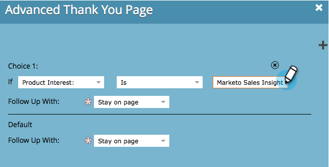
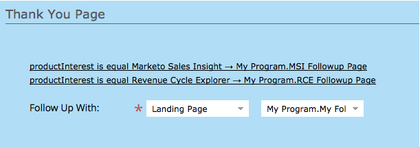

# 设置表单感谢页面 {#set-a-form-thank-you-page}

当某人填写表单时会发生什么情况？ 他们转到哪里？ 下面是如何配置它。

## 编辑表单 {#edit-form}

1. 转到营 **销****活动**。

   

1. 选择表单，然后单击“ **编辑表单**”。

   

1. 在“表 **单设****置** ”下 **，单**&#x200B;击“设置”。

   

1. 向下滚动到“感 **谢****页****** ”部分。

## 保持在页面上 {#stay-on-page}

提交表单后，“保留在页面上”选项将使访客保留在同一页面上。

1. 选择“ **继续****** Page **On Page”,** 以 ************&#x200B;跟随。

   

## 外部URL {#external-url}

外部URL设置允许您将任何URL定义为后续页面。 用户提交表单后，会将其定向到指定的URL。

1. 选择 **外部** URL **** , **以随** 后 **升******&#x200B;到。

   

1. 输入完整URL。

   

>[!TIP]
>
>URL可以是某处托管的文件的URL —— 如果这样做，“提交”按钮的行为将类似于“下载”按钮。

## 登陆页 {#landing-page}

您可以选择任何已批准的营销人员登陆页作为后续操作。

1. 设 **置跟进** 到 **登陆页**。

   

1. 查找并选择所需的登陆页。

   

## 动态感谢页面 {#dynamic-thank-you-pages}

您可以添加多个选项并增加选项，根据用户的答复显示不同的后续操作。

1. 单击 **添加****选择**。

   

1. 选择要监视其响应的字段。

   

   >[!TIP]
   >
   >只有添加到表单的字段才可用。

1. 选择所需的逻辑运算符。

   

1. 输入用户将用来响应的值之一。

   

1. 为“跟进类型” **选****择** 适 **合的页** 面。

   

1. 选择相应的登陆页。

   

   >[!NOTE]
   >
   >**提醒**
   >
   >
   >您必须提前创建／批准这些登陆页。

1. 单击+ **符号** ，添加其他选项。

   

   >[!NOTE]
   >
   >您可以添加多个选项。 但是，如果添加的内容过多，则会影响表单的加载速度，因此只添加所需内容。

1. 浏览并设置 **Choice****2**。

   

   >[!TIP]
   >
   >您可以随意混合和匹配后续类型。 您可以将登陆页用于一个选项，将URL用于另一个选项。

1. 为所有其他响应设置默认页面。

   

1. 选择页面本身，然后单击“ **保存**”。

   

   看起来不错！

   

1. 单击 **完成**。

   

1. 单击 **批准并关闭**。

   

干得好！
