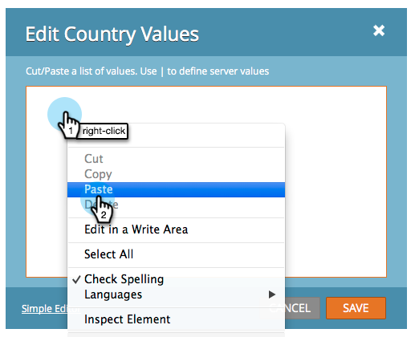

# 在表单中添加国家/地区选择列表 {#add-a-country-picklist-to-your-form}

按照这些说明将“country”字段转换为包含所有国家/地区列表的下拉列表。

1. 转到 **营销活动**.

   

1. 选择您的表单并单击 **编辑表单**.

   

1. 单击 **+** 签名。

   

1. 查找并选择 **国家/地区**.

   

1. 使用 **国家/地区** 所选字段更改 **字段类型** 到 **选择**.

   

1. **编辑** 此 **值** 以添加用户可以从中进行选择的国家/地区列表。

   

1. 单击 **高级** **编辑者**.

   

1. 选择并复制以下国家/地区列表：

   ```
   Afghanistan Albania Algeria Andorra Angola Antigua & Deps Argentina Armenia Australia Austria Azerbaijan Bahamas Bahrain Bangladesh Barbados Belarus Belgium Belize Benin Bhutan Bolivia Bosnia Herzegovina Botswana Brazil Brunei Bulgaria Burkina Burundi Cambodia Cameroon Canada Cape Verde Central African Rep Chad Chile China Colombia Comoros Congo Congo (Democratic Rep) Costa Rica Croatia Cuba Cyprus Czech Republic Denmark Djibouti Dominica Dominican Republic East Timor Ecuador Egypt El Salvador Equatorial Guinea Eritrea Estonia Ethiopia Fiji Finland France Gabon Gambia Georgia Germany Ghana Greece Grenada Guatemala Guinea Guinea-Bissau Guyana Haiti Honduras Hungary Iceland India Indonesia Iran Iraq Ireland (Republic) Israel Italy Ivory Coast Jamaica Japan Jordan Kazakhstan Kenya Kiribati Korea North Korea South Kosovo Kuwait Kyrgyzstan Laos Latvia Lebanon Lesotho Liberia Libya Liechtenstein Lithuania Luxembourg Macedonia Madagascar Malawi Malaysia Maldives Mali Malta Marshall Islands Mauritania Mauritius Mexico Micronesia Moldova Monaco Mongolia Montenegro Morocco Mozambique Myanmar (Burma) Namibia Nauru Nepal Netherlands New Zealand Nicaragua Niger Nigeria Norway Oman Pakistan Palau Panama Papua New Guinea Paraguay Peru Philippines Poland Portugal Qatar Romania Russian Federation Rwanda St Kitts & Nevis St Lucia Saint Vincent & the Grenadines Samoa San Marino Sao Tome & Principe Saudi Arabia Senegal Serbia Seychelles Sierra Leone Singapore Slovakia Slovenia Solomon Islands Somalia South Africa South Sudan Spain Sri Lanka Sudan Suriname Swaziland Sweden Switzerland Syria Taiwan Tajikistan Tanzania Thailand Togo Tonga Trinidad & Tobago Tunisia Turkey Turkmenistan Tuvalu Uganda Ukraine United Arab Emirates United Kingdom United States Uruguay Uzbekistan Vanuatu Vatican City Venezuela Vietnam Yemen Zambia Zimbabwe
   ```

1. 将列表粘贴到编辑器中。

   

   >[!TIP]
   >
   >您可以随意编辑列表或使用任何其他列表。

1. 单击 **保存**.

   

1. 单击 **完成**.

   

1. 单击 **批准并关闭**.

   

   做得好！ 现在，当某人填写您的表单时，他们可以从您提供的国家/地区列表中进行选择。

   

既然这太简单了，何不多做点呢？ 当用户选择美国作为列表中的国家/地区时，如何动态显示State字段？ 请查看下面的相关文章，了解如何执行该操作。

>[!MORELIKETHIS]
>
>[动态切换表单字段的可见性](/help/marketo/product-docs/demand-generation/forms/form-fields/dynamically-toggle-visibility-of-a-form-field.md)
