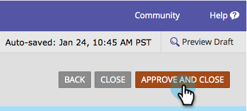

# 向表单添加富文本 {#add-rich-text-to-a-form}

在表单中使用富文本可在字段之间添加说明或其他信息。

1. 前往 **[!UICONTROL Marketing Activities]**。

   

1. 选择您的表单并单击&#x200B;**[!UICONTROL Edit Form]**。

   

1. 单击&#x200B;**+**&#x200B;符号。

   

1. 选择 **[!UICONTROL Rich Text]**。

   

1. 输入所需的文本。

   

   >[!TIP]
   >
   >如果表单中需要行分隔符，请使用“水平线”按钮。

1. 单击 **[!UICONTROL Save]**。

   

1. 单击 **[!UICONTROL Finish]**。

   

1. 单击 **[!UICONTROL Approve and Close]**。

   

   

>[!TIP]
>
>您是否知道您还可以[将可见性规则](/help/marketo/product-docs/demand-generation/forms/form-fields/dynamically-toggle-visibility-of-a-form-field.md)添加到RTF块？
