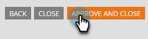

# 更改表单的语言 {#change-the-language-of-a-form}

了解如何更改表单的语言。

1. 转到 **营销活动**.

   

1. 选择您的表单并单击 **编辑表单**.

   

1. 单击 **表单设置** 并选择 **设置**.

   

1. 选择所需的 **表单语言**.

   

   可选步骤：选择所选语言的区域设置/区域。

   

1. 单击 **完成**.

   

1. 单击 **批准并关闭** 以应用并保存更改。

   

   >[!NOTE]
   >
   >该表单必须获得批准才能在登陆页面上使用。

   >[!TIP]
   >
   >请记住 [批准登陆页面](/help/marketo/product-docs/demand-generation/landing-pages/understanding-landing-pages/approve-unapprove-or-delete-a-landing-page.md) 由表单创建的草稿发生更改。

您的表单现在将反映您选择的语言。

