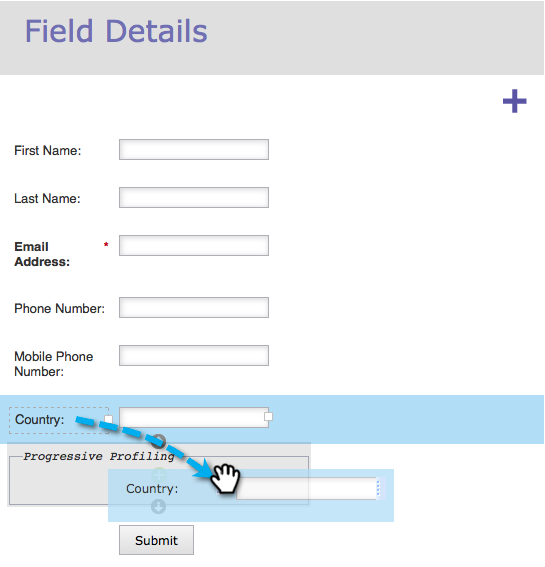
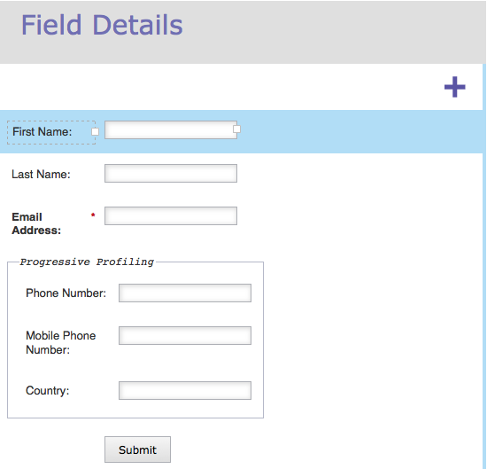

# 配置表单渐进分析 {#configure-form-progressive-profiling}

短表格很好！ 当有人返回表单时，您可以显示新字段并逐步填写访客的配置文件。 这是方法。

>[!NOTE]
>
>要使此功能正常工作，请确保为可见字段启用“表单预填充”，并 [已禁用](/help/marketo/product-docs/demand-generation/forms/form-fields/disable-pre-fill-for-a-form-field.md) ，以查看隐藏字段。

1. 转到 **营销活动**.

   

1. 选择您的表单并单击 **编辑表单**.

   

1. 在 **表单设置**，单击 **设置**.

   

1. 已设置 **渐进轮廓** to **已启用**.

   

1. 好，现在让我们配置它。 转到 **字段详细信息**.

   

1. 拖放属于渐进式配置文件集的所有字段。

   

1. 移动完所有字段后，应当如下所示：

   

   >[!NOTE]
   >
   >外部的字段 **渐进轮廓** 框将始终显示在表单中，即使已填写。

1. 选择 **渐进轮廓** 框中。

   

   >[!CAUTION]
   >
   >在渐进式分析中使用必填字段时要小心。 如果访客在先前提交其他字段的数据后输入新电子邮件地址（这会创建新人员），则这些字段仍可留空，因为最新表单上会禁止显示这些字段。

1. 现在，选择您希望用户从 **渐进轮廓** 框中。

   

   >[!NOTE]
   >
   >如果您选择 **数值** **of** **空白** **字段** 作为1，访客在第一次看到此表单时将看到以下内容：
   >
   >* 名字（空）
   >* 姓氏（空）
   >* 电子邮件地址（空）
   >* 电话号码（空）

   >
   >假设他们在第二次访问时填写每个字段，他们将看到：
   >
   >* 名字（预填）
   >* 姓氏（预填）
   >* 电子邮件地址（预填）
   >* 手机号码（空）

   >
   >假设他们填写了手机号码，那么他们第三次访问时将看到：
   >
   >* 名字（预填）
   >* 姓氏（预填）
   >* 电子邮件地址（预填）
   >* 国家/地区（空）

1. 单击 **完成**.

   

1. 单击 **批准并关闭**.

   

干得好！ 你刚才的工作会有回报的。

尝试使用此功能，并确保进行测试。 它是高级的，但您可以通过这种方式使表单非常动态。
