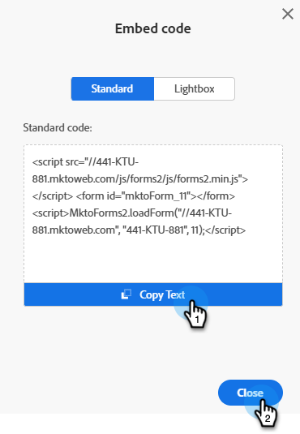

# 在您的网站上嵌入表单 {#embed-a-form-on-your-website}

访问表单的嵌入代码以将其托管在您自己的网站上。

>[!PREREQUISITES]
>
>表单必须经过批准才能使用嵌入代码。

1. 查找并选择所需的表单。

   

1. 在表单详细信息屏幕的右侧，单击&#x200B;**[!UICONTROL Embed code]**。

   

   >[!CAUTION]
   >
   >在您自己的页面&#x200B;_或_ Marketo登录页面上使用表单嵌入代码时，**[表单预填充](/help/marketo/product-docs/administration/settings/edit-landing-page-settings.md)**&#x200B;不起作用。 仅当表单通过“插入元素”选项用于Marketo登录页面时，表单预填充才起作用。

1. 在&#x200B;_标准_&#x200B;选项卡中，单击&#x200B;**[!UICONTROL Copy Text]**。 完成后，单击 **[!UICONTROL Close]**。

   

   >[!NOTE]
   >
   >对于Lightbox代码，请参阅[在Lightbox中使用表单](/help/marketo/product-docs/demand-generation/forms/form-actions/use-a-form-in-a-lightbox.md)。

1. 将嵌入代码提供给您的Web开发人员。

   将代码嵌入到您的网站后，对Marketo Engage中的表单所做的任何更改都将在表单获得批准后推送至您的网站。 您无需更改代码。

   >[!TIP]
   >
   >如果您的开发人员想要自定义外观或访问高级API功能，请向他们显示[Forms 2.0开发人员页面](https://experienceleague.adobe.com/zh-hans/docs/marketo-developer/marketo/javascriptapi/forms-api-reference)。
